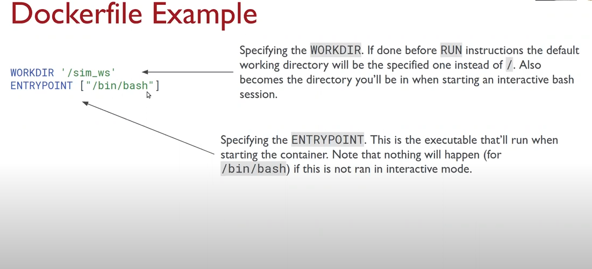

# F1Tenth Course - Learning

### Getting Started
- [Start Here!](https://f1tenth-coursekit.readthedocs.io/en/latest/getting_started/index.html#)

### Overview
- [Introduction](https://f1tenth-coursekit.readthedocs.io/en/latest/introduction/overview.html)
- [Syllabus](https://f1tenth-coursekit.readthedocs.io/en/latest/introduction/syllabus.html)

### Modules

- [Module A: Introduction to ROS, F110 & the simulator](https://f1tenth-coursekit.readthedocs.io/en/latest/lectures/ModuleA/index.html#)
    -  [Lecture 1 - Introduction to Autonomous Driving: Perception, Planning Control](https://f1tenth-coursekit.readthedocs.io/en/latest/lectures/ModuleA/lecture01.html)
            
        - [Tutorial 1: Introduction to ROS2](https://f1tenth-coursekit.readthedocs.io/en/latest/lectures/ModuleA/tutorial1.html)

    - [Lecture 2 - Automatic Emergency Braking](https://f1tenth-coursekit.readthedocs.io/en/latest/lectures/ModuleA/lecture02.html)
        - [Tutorial 2 - Introduction to F1TENTH Simulator](https://f1tenth-coursekit.readthedocs.io/en/latest/lectures/ModuleA/tutorial2.html)
    
    - [Lecture 3 - Rigid Body Transformation](https://f1tenth-coursekit.readthedocs.io/en/latest/lectures/ModuleA/lecture03.html)
        - [Tutorial 3 - ROS2 and tf2](https://f1tenth-coursekit.readthedocs.io/en/latest/lectures/ModuleA/tutorial3.html)


## Module A: Introduction to ROS, F110 & the Simulator

Module A: Introduction to ROS, F110 & the Simulator
The first module goes over the some of the basics required to understand and control the F1TENTH Autonomous Vehicle System.

Lecture 1 - [Introduction to Autonomous Driving: Perception, Planning Control](https://f1tenth-coursekit.readthedocs.io/en/latest/lectures/ModuleA/lecture01.html)

Lecture 2 - [Automatic Emergency Braking](https://f1tenth-coursekit.readthedocs.io/en/latest/lectures/ModuleA/lecture02.html)

Lecture 3 - [Rigid Body Transformation](https://f1tenth-coursekit.readthedocs.io/en/latest/lectures/ModuleA/lecture03.html)

### Lecture 1 - Introduction to Autonomous Driving: Perception, Planning Control
#### Overview:
This lecture is an introduction to the F1TENTH Autonomous Vehicle Community. We will give brief introduction to the world of autonomous racing and step through each lecture on perception, planning and control. By the end of this lecture, you will have gotten your first taste of the exciting world of autonomous systems.

#### Topics Covered:
- Course Logistics
- Course Support
- Intro to Autonomous Systems

#### Associated Tutorial:
- [Tutorial 1: Introduction to ROS2](https://f1tenth-coursekit.readthedocs.io/en/latest/lectures/ModuleA/tutorial1.html)
#### Associated Assignment:
- [Lab 1: Introduction to ROS2](https://f1tenth-coursekit.readthedocs.io/en/latest/assignments/labs/lab1.html#doc-lab1)

### Tutorial 1: Introduction to ROS2

#### Overview:
This lecture is more of a short tutorial than a traditional lecture. You will learn about ROS2.

#### Topics Covered:
- Docker
- ROS2

#### Tutorial 1 Notes

**Introduction to Docker**
- What is Docker?
    - Allows for easy deployment of software in a loosely isolated sandbox (containers).
    - Can run many containers simultaneously on a given host.
    - Containers are lightweight and contain everything needed torun the application, so you do not need to rely on what is currently installed on the host.
    - The key benefit of Docker is it allows users to package an application with **all of it dependencies into a standardized unit**.

**Overview: Docker Architecture**


- Images
    - Read-only template with instructions for a Docker container.
    - Often, an image is based on another image, with some additional customization.
    - You might create your own images or you might only use those created by others and published in a registry.
    - To build your own image, you create a DOckerfile with a simple syntax for defining the steps needed to create the image and run it. Each instruction in a Dockerfile creates a layer in the image. When you change the Dockerfile and rebuild the image, only those layers which have changed are rebuilt. This is part of what makes images so lightweight, small, and fast, when compared to other virtualization technologies.

#### Containers

- Runable instance of an image. YOu can create, start, stop, move, or delete a container using the Docker API or CLI. You can connect a container to one or more networks, attach storage to it.
- By default, a container is relatively well isolated from other containers and it's host machine.
- A container is defined by its image as well as any configuration option you provide to it when you create or start it. When a container is removed, any changes to its state that are **not** stored in persistent storage will disappear.

#### Commonly Used Commands

- `$ docker pull [OPTIONS]  NAME[:TAG|@DIGEST]`
    
    Pull an iimage or repository from a registry

- `$ docker run [OPTION] IMAGE [COMAND] [ARG...]`

    First creates a writeable container layer over the specified image, and then starts it using the specified command.
    
    **Notable Options:**

    - `--name`: Assign name to container
    - `it`: Combination of both --interactive(-i) and --tty(-y): keep STDIN open even if not attached, and allocated a pseudo-TTY
    - `-v`: Bind mount a volume (more on this later)
    - `--rm`: Automatically remove the container when it exits
    - `--net/--network`: Connect a container to a network (more on this later)
    - `-p`: Publish a container's port(s) to the host

- `$ docker build [OPTION] PATH | URL | -`

    Build an image from a Dockerfile. A build's context is the set of files located in the specified `PATH` or `URL`.
    **Noteable options:**
    - `-f`: Name of the Dockerfile, default is 'PATH/Dockerfile'
    - `-force-rm`: Always remove intermediate containers
    - `-no-cache`: Do not use cach wne building the image

- `$ docker ps [OPTION]`

    list containers

    **Noteable options:**
    - `-a`: Show all containers, running and stopped
    - `-s`: Display total file size

- `$ docker images [OPTION] [REPOSITORY[:TAG]]`

    List images

    **Noteable options:**
    - `-a`: SHow all images, default hides intermediate images

- `$ docker rm [OPTION] CONTAINER [CONTAINER...]`

    Remove one or more containers

    **Noteable option:**
    - `-f`: Force the removal of a running container (SIGKILL)

- `$ docker rmi [OPTION] IMAGE [IMAGE...]`

    Remove one or more images

    **Noteable option:**
    - `-f`: Force the removal of an image

- `$ docker exec [OPTION] CONTAINER COMMAND [ARG...]`

    Run a command in a running container. Usually used to open an interactive bash in a running container

    **Noteable option:**
    - `-it`: combination of both --interactive(-i) and --tty(-t): keeps STDIN open even if not attached and allocated a pseudo-TTY

- `$ docker cp [OPTION] CONTAINER:SRC_PATH DEST_PATH`

Or:

- `$ docker cp [OPTION] SRC_PATH CONTAINER:DEST_PATH`

    Copy files/folders between container and the local filesystem. Behaves like the UNIX `cp`, and will have similar options for copying recursivley, ect.

#### Dockerfile Syntax

**Dockerfile**

Dockerfiles are instruction for Docker to build images automatically. Using `docker build` users can create an automated build that execites several command-line instructions in succession.

In general, the format is:

```
# Comment
INTRUCTION arguments
```

Docker runs instructions in a `Dockerfile` in order. A `Dockerfile` **must begin with a `FROM` instruction**. The `FROM` instruction specifies the Pareent Image from which you are building. `FROM` may only be preceded by one or more `ARG` instructions, which declare argumentsthat are used in `FROM` lines in the `Dockerfile`.

**The `RUN` instruction has 2 forms:**

- `RUN <command>`

    *shell form, the command is run in a shell. Default is `/bin/sh -c` on linux, or `cmd /S /C` on Windows*

- `RUN ["executable", "param1", "param2"]`

    *exec form*

**THe `CMD` instruction has 3 forms:**

- `CMD ["executable", "param1", "param2"]`

    *exec form, this is the preferred form*

- `CMD ["param1", "param2"]`

    *As default parameters to `ENTRYPOINT`*

- `CMD command param1 param2`

    *shell form*

There can only be one `CMD` instruction in the `Dockerfile`. If you list more than one `CMD` then only the last one will take effect.

The **main purpose** of `CMD` is to provide defaults for an executing container. These defaults can include an executable, or they can omit the executable, in which case you must specify an `ENTRYPOINT` instruction as well.

`ENV <key>=<value> ...`

- The `ENV` instruction sets the environment variable `<key>` to the value `<value>`. This value will be interpreted for other environment variables.
- The environment variable set using `ENV` **will persist** when a conainer is run from the resulting image.

Alternatively you can use `ARG <key>=<value> ...`

- `ARG` **will not presist** when a container is run from the resulting image.

The `COPY` instruction copies new files or directories from <src> and adds the to the filesystem of the container at the path <dest>

- The `COPY` instruction has 2 forms:
    - `COPY [--chown=<user>:<group>] <src>... <dest>`
    - `COPY [--chown=<user>:<group>] ["<src>",... "<dest>"]`

The `ENTRYPOINT` instruction has 2 forms:

- `ENTRYPOINT ["executable", "param1", "param2"]`
    
    *exec form, this is the preferred form*
- `ENTYPOINT command param1 param2`

    *shell form*

An `ENTRYPOINT` allows you to configure a container that will run as executable.

#### Dockerfile Example





#### Docker network


#### Introduction to ROS2

[PDF of Power Point](<../../Downloads/[Penn] T01 Intro to ROS2.pdf>)

### Lecture 2 - Automatic Emergency Braking

#### Overview:
This lecture goes over the importance of safety when working with autonomous systems. When is a system “safe enough” to deploy? In this lecture, you will learn about how Automatic Emergency Braking (AEB) works in today’s vehicle as well as methods for gathering information about the outside world in order for the vehicle to respond to it appropriately. Once the vehicle has acquired real world data and reacts to its situation accordingly, how do we measure how “safe” the reaction is?

#### Topics Covered:

- Autonomatic Emergency Braking (AEB)
- Range Sensors for Autonomous Vehicles
- Working with Laser Scan Data
- Notions of Correctness

#### Associated Tutorial:
Tutorial 2 - [Introduction to RoboRacer Simulator](https://f1tenth-coursekit.readthedocs.io/en/latest/lectures/ModuleA/tutorial2.html)

#### Associated Assignment:

Lab 2: [Automatic Emergency Braking](https://f1tenth-coursekit.readthedocs.io/en/latest/assignments/labs/lab2.html#doc-lab2)

#### Lesson Plan

- Part I: Automatic Emergency Braking (AEB) on the road
- Part II: Range sensors for autonomous vehicle
- Part III: Working with laser scan data
- Part IV: Measuring safety
- Part V: Lab Overview

#### AEB in Today's Vehicles

1. Detect Objest
2. Find range, heading, and velocity
3. Determine Critical Object
4. Check trajectory for imminent collision

To start at a basic level we need to figure out what vehicles are critical and not critical. This is a **Binary Classifier**.

Understand the Ground Truth and Classifier Output table.
- Ground Truth - actual outcome
- Prediction made by the autonomous vehicle

Talk about different cameras to use for the F1TENTH cameras

### Tutorial 2 - Introduction to RoboRacer Simulator

#### Overview:
- Walkthrough of the RoboRacer simulator installation, vehicle model, default ROS topics and keyboard control.
- This will help you get started with Lab 2 where you will design a safety co-pilot for your car to prevent it from crashing into static obstacles and walls.

