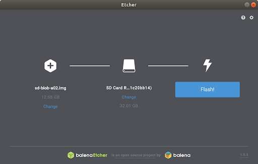
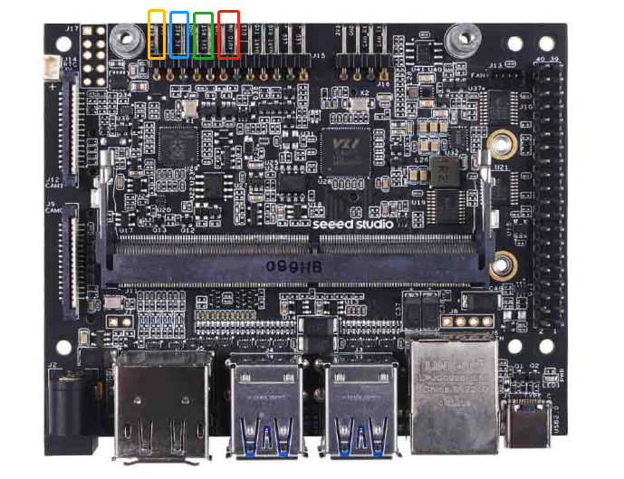
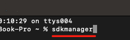

# Jetson Orin Nano Developer Kit Getting Started Guide
https://developer.nvidia.com/embedded/learn/get-started-jetson-orin-nano-devkit#prepare

# Download and Run SDK Manager

### Install with Network Repository

**Network Repo Installation for Ubuntu**

The new GPG public key for the NVIDIA compute repository is [3bf863cc](https://developer.download.nvidia.com/compute/cuda/repos/ubuntu1604/x86_64/3bf863cc.pub). This must be enrolled on the system, either using the `cuda-keyring` package or manually; the `apt-key` command is deprecated and not recommended.

1. **Install the cuda-keyring package.**

```
wget https://developer.download.nvidia.com/compute/cuda/repos/$distro/x86_64/cuda-keyring_1.1-1_all.deb
```

where `$distro` should be replaced by one of the following, according to your current distribution:

- `ubuntu1804`

- `ubuntu2004`

- `ubuntu2204`

- `debian10`

```
sudo dpkg -i cuda-keyring_1.1-1_all.deb
```

2. Alternatively, if you are unable to install the `cuda-keyring` package, you can do one of the following:

a. Enroll the new signing key manually.

```
wget https://developer.download.nvidia.com/compute/cuda/repos/<distro>/<arch>/cuda-archive-keyring.gpg
sudo mv cuda-archive-keyring.gpg /usr/share/keyrings/cuda-archive-keyring.gpg
```

   b. Enable the network repository.

```
echo "deb [signed-by=/usr/share/keyrings/cuda-archive-keyring.gpg] https://developer.download.nvidia.com/compute/cuda/repos/<distro>/<arch>/ /" | sudo tee /etc/apt/sources.list.d/cuda-<distro>-<arch>.list
```

c. Add a pin file to prioritize the CUDA repository.

```
wget https://developer.download.nvidia.com/compute/cuda/repos/<distro>/<arch>/cuda-<distro>.pin
sudo mv cuda-<distro>.pin /etc/apt/preferences.d/cuda-repository-pin-600
```

3. Installation for Ubuntu:

```
sudo apt update
sudo apt install sdkmanager
```


## Write Image to the microSD Card
To prepare your microSD card, you’ll need a computer with Internet connection and the ability to read and write SD cards, either via a built-in SD card slot or adapter.

1. Download the Jetson Orin Nano Developer Kit SD Card image from [JetPack SDK Page](https://developer.nvidia.com/embedded/jetpack) , and note where it was saved on the computer.

2. Write the image to your microSD card by following the instructions below according to the type of computer you are using: Windows, Mac, or Linux.

## INSTRUCTIONS FOR LINUX
You can either write the SD card image using a graphical program like Etcher, or via command line.

### Etcher Instructions
1. Download, install, and launch [Etcher](https://etcher.balena.io/) Follow link and ...

      **Download**: ETCHER FOR LINUX X64 (64-BIT) (APPIMAGE)
LINUX
X64
[Download](https://github.com/balena-io/etcher/releases/download/v1.18.11/balenaEtcher-1.18.11-x64.AppImage)


## Etcher Download, Install, and Launch

Let’s walk through the steps to download, install, and launch Etcher on Ubuntu 22.04 (Jammy Jellyfish):

1. **Update System Packages**: First, ensure that all your system packages are up-to-date by running the following commands in the terminal:

```
sudo apt update
sudo apt upgrade
sudo apt install wget apt-transport-https gnupg2
```

2. Install BalenaEtcher:
- By default, BalenaEtcher is not available in the Ubuntu 22.04 base repository. To add the Etcher repository to your system, run the following command:

```
curl -1sLf 'https://dl.cloudsmith.io/public/balena/etcher/setup.deb.sh' | sudo -E bash
```

- Once the repository is enabled, install the latest version of Etcher using this command:

```
sudo apt update
chmod +x /home/erickj1/Downloads/balenaEtcher-1.18.11-x64.AppImage
/home/erickj1/Downloads/balenaEtcher-1.18.11-x64.AppImage
```

- Confirm the installation and check the installed build version of Etcher:

```
etcher --version
```

3. Access Etcher: After successful installation, you can access Etcher from your desktop:
- Click on **Activities** (top-left corner).
- Search for **Etcher** and click to open the application.
- Etcher’s intuitive interface will guide you through the process of flashing ISO files to USB sticks or SD cards.


Remember, Etcher is a reliable tool for creating bootable drives, ensuring data integrity, and preventing accidental writes to your hard drives. Happy flashing!


2. Click “Select image” and choose the zipped image file downloaded earlier. 

Extract the zip file 

- **sd-blob.img**

3. Insert your microSD card. If you have no other external drives attached, Etcher will automatically select the microSD card as target device. Otherwise, click “Change” and choose the correct device.



4. Click “Flash!” Your OS may prompt for your username and password before it allows Etcher to proceed.


It will take Etcher 10-15 minutes to write and validate the image if your microSD card is connected via USB3.

5. After Etcher finishes, eject the SD Card using Files application:


6. Physically remove microSD card from the computer.

### Command Line Instructions
1. Open the Terminal application by pressing `Ctrl + Alt + t`.

2. Insert your microSD card, then use a command like this to show which disk device was assigned to it:
`dmesg | tail | awk '$3 == "sd" {print}'`

In this example, we can see the 16GB microSD card was assigned /dev/sda:


3. Use this command to write the zipped SD card image to the microSD card:

`/usr/bin/unzip -p ~/Downloads/jp60dp-orin-nano-sd-card-image.zip | sudo /bin/dd of=/dev/sda1 bs=1M status=progress`

For example:


When the dd command finishes, eject the disk device from the command line:
`sudo eject /dev/sda1`

4. Physically remove microSD card from the computer.

After your microSD card is ready, proceed to [Setup your developer kit](https://developer.nvidia.com/embedded/learn/get-started-jetson-orin-nano-devkit#setup).

### Setup and First Boot
**Setup Steps**
1. Insert the microSD card (with system image already written to it) into the slot on the underside of the Jetson Orin Nano module.
2. Power on your computer display and connect it.
3. Connect the USB keyboard and mouse.
4. Connect the provided power supply. The Jetson Orin Nano Developer Kit will power on and boot automatically.


**First Boot**

A green LED next to the USB-C connector will light as soon as the developer kit powers on. When you boot the first time, the Jetson Orin Nano Developer Kit will take you through some initial setup, including:

- Review and accept NVIDIA Jetson software EULA
- Select system language, keyboard layout, and time zone
- Connect to Wireless network
- Create username, password, and computer name
- Log in

**After Logging In**
You will see this screen. Congratulations!


# Install NVIDIA SDK Manager on the Linux Host PC

### Getting Started
First of all we need to get the software and hardware ready in order to flash new Jetpack OS:

### Prerequisite
Here is the list of required software and hardware:

- Host Computer with Ubuntu 22.04 operating system
- Nvidia Orin Nano Developer Kit module. Power Supply: 19V/2.73A (Comes with kit)
- USB Type-C cable
- Jumper pin/cable

### Hardware Preparation (Force Recovery Mode)
Before we can move on to the installation steps, we need to make sure that our Jetson is in the force recovery mode.

**Step 1.** Before you start, you need to disconnect power of the Jetson

**Step 2.** To enter recovery mode, you need to connect FC REC and GND using jumpers.



##  1 Install NVIDIA SDK Manager on the Linux Host PC
First of all you need to create a [NVIDIA account](https://developer.nvidia.com/login) in order to use sdkmanager. Then on the Linux Host PC download the [NVIDIA SDK Manager](https://developer.nvidia.com/sdk-manager) from the NVIDIA official website. 

- Download NVIDIA SDK Manager 2.1.0

## 2 Open NVIDIA SDK Manager and login
On the Linux host PC screen, open a Terminal, then we can type the command below to start the SDK Manager:

`sdkmanager`

as shown below:



The first time you use NVIDIA SDK Manager, a web page will pop up prompting you to log in with your previously registered NVIDIA account.

Then close the SDK Manager and connect the Jetson
 - Ensure the Jetson is in Recovery Mode
 - Connect the Power Supply
 - Connect Jetson to host machine USB-Type-C cable
 - Insert the SD card

## 3 Select the target device

Reopen the SDK Manager using the Terminal and the `sdkmanager` command.

Then this window will open. Select **Jetson Orin Nano [8GB developer kit version]**


### Step 1 Development Environment
**Select**
- PRODUCT CATEGORY **Jetson**
- **SYSTEM CONFIGURATION** 
   **- Target Hardware** Jetson Orin Nano modules
- **SDK VERSION** **- JetPack 6.0 DP**

**Unselect**
- **SYSTEM CONFIGURATION**   **- Host Machine**
- **ADDITIONAL SDKS** **- DeepStream**


### Step 2 Details and License

**Select**

  - **I accept the terms and conditions of the license agreement**
  - Create folders

### Before moving on take the board out of Recovery Mode


### Step 3

**Enter**
-New Username
-New Password


<span style="color:red;">

# [Etcher Setup](https://etcher.balena.io/)


Follow this [Debian (.deb) packages]() link to a Github README

## Etcher
- Flash OS images to SD cards & USB drives, safely and easily.

Etcher is a powerful OS image flasher built with web technologies to ensure flashing an SDCard or USB drive is a pleasant and safe experience. It protects you from accidentally writing to your hard-drives, ensures every byte of data was written correctly, and much more. It can also directly flash Raspberry Pi devices that support [USB device boot mode](https://www.raspberrypi.com/documentation/computers/raspberry-pi.html#usb-device-boot-mode).

Current Release License Balena.io Forums

[Download](https://etcher.balena.io/) | [Support](https://github.com/balena-io/etcher/blob/master/docs/SUPPORT.md) | [Documentation](https://github.com/balena-io/etcher/blob/master/docs/USER-DOCUMENTATION.md) | [Contributing](https://github.com/balena-io/etcher/blob/master/docs/CONTRIBUTING.md) | [Roadmap](https://github.com/balena-io/etcher/milestones)

## Supported Operating Systems
- Linux; most distros; Intel 64-bit.
- Windows 10 and later; Intel 64-bit.
- macOS 10.13 (High Sierra) and later; both Intel and Apple Silicon.

## Installers
Refer to the [downloads page](https://etcher.balena.io/) for the latest pre-made installers for all supported operating systems.

## Packages
**Debian and Ubuntu based Package Repository (GNU/Linux x86/x64)**
Package for Debian and Ubuntu can be downloaded from the [Github release page](https://github.com/balena-io/etcher/releases/)

**Install .deb file using apt**
```
   sudo apt install ./balena-etcher_******_amd64.deb
```

**Uninstall**
```
   sudo apt remove balena-etcher
```

**Redhat (RHEL) and Fedora-based Package Repository (GNU/Linux x86/x64)**

**Yum**

Package for Fedora-based and Redhat can be downloaded from the [Github release page](https://github.com/balena-io/etcher/releases/)

1. Install using yum
```
   sudo yum localinstall balena-etcher-***.x86_64.rpm
```

**Arch/Manjaro Linux (GNU/Linux x64)**
Etcher is offered through the Arch User Repository and can be installed on both Manjaro and Arch systems. You can compile it from the source code in this repository using balena-etcher. The following example uses a common AUR helper to install the latest release:

```
yay -S balena-etcher
```

**Uninstall**
```
yay -R balena-etcher
```
## Support
If you're having any problem, please [raise an issue](https://github.com/login?return_to=https%3A%2F%2Fgithub.com%2Fbalena-io%2Fetcher%2Fissues%2Fnew) on GitHub, and the balena.io team will be happy to help.

License
Etcher is free software and may be redistributed under the terms specified in the [license](https://github.com/balena-io/etcher/blob/master/LICENSE).

<span style="color:white;">

# Setup and First Boot

## Setup Steps
1. Insert the microSD card (with system image already written to it) into the slot on the underside of the Jetson Orin Nano module.
2. Power on your computer display and connect it.
3. Connect the USB keyboard and mouse.
4. Connect the provided power supply. The Jetson Orin Nano Developer Kit will power on and boot automatically.


## First Boot
A green LED next to the USB-C connector will light as soon as the developer kit powers on. When you boot the first time, the Jetson Orin Nano Developer Kit will take you through some initial setup, including:

>- Review and accept NVIDIA Jetson software EULA
>- Select system language, keyboard layout, and time zone
>- Connect to Wireless network
>- Create username, password, and computer name
>- Log in

## After Logging In
You will see this screen. Congratulations!
