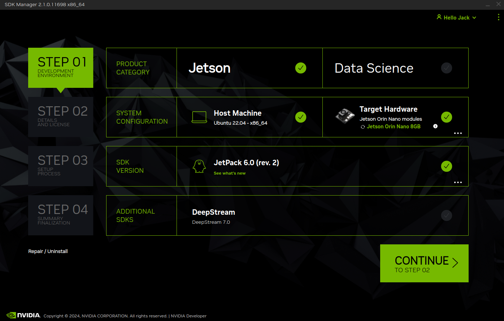
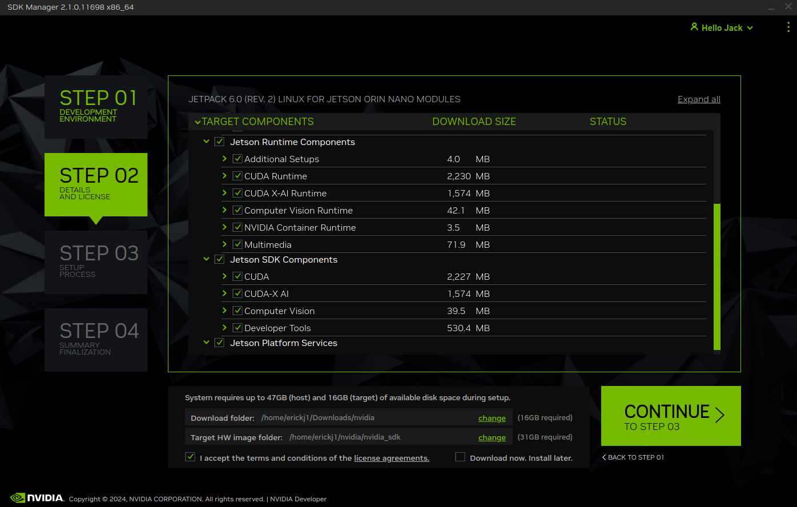
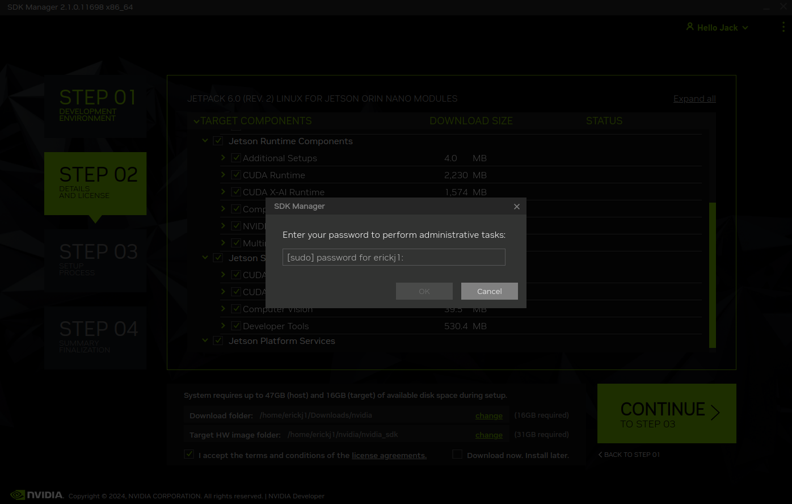

# 1. Configure the Jeston Orin Nano
### Write Image to the microSD Card
To prepare your microSD card, you’ll need a computer with Internet connection and the ability to read and write SD cards, either via a built-in SD card slot or adapter.

1. Download the Jetson Orin Nano Developer Kit SD Card image from [JetPack SDK Page](https://developer.nvidia.com/embedded/jetpack) , and note where it was saved on the computer.

2. Write the image to your microSD card by following the instructions below according to the type of computer you are using: Windows, Mac, or Linux.

### Command Line Instructions
1. Open the Terminal application by pressing `Ctrl + Alt + t`.

2. Insert your microSD card, then use a command like this to show which disk device was assigned to it:

`dmesg | tail | awk '$2 == "sd" {print}'`

In this example, we can see the 16GB microSD card was assigned /dev/sda:

### I unable to get the terminal to return this command


3. Use this command to write the zipped SD card image to the microSD card:

`/usr/bin/unzip -p ~/Downloads/jp60-orin-nano-sd-card-image.zip | sudo /bin/dd of=/dev/sda bs=1M status=progress
`

For example:


When the dd command finishes, eject the disk device from the command line:
`sudo eject /dev/sda`

4. Physically remove microSD card from the computer.

After your microSD card is ready, proceed to [Setup your developer kit](https://developer.nvidia.com/embedded/learn/get-started-jetson-orin-nano-devkit#setup).

### Setup and First Boot
**Setup Steps**
1. Insert the microSD card (with system image already written to it) into the slot on the underside of the Jetson Orin Nano module.
2. Power on your computer display and connect it.
3. Connect the USB keyboard and mouse.
4. Connect the provided power supply. The Jetson Orin Nano Developer Kit will power on and boot automatically.


**First Boot**

A green LED next to the USB-C connector will light as soon as the developer kit powers on. When you boot the first time, the Jetson Orin Nano Developer Kit will take you through some initial setup, including:

- Review and accept NVIDIA Jetson software EULA
- Select system language, keyboard layout, and time zone
- Connect to Wireless network
- Create username, password, and computer name
- Log in

**After Logging In**
You will see this screen. Congratulations!


## 2. Run Jetson NX from SSD
In the build instruction we applied an SSD NVMe on to the Jetson NX. We will now make use of this SSD by switching the rootfs to point to the SSD. In effect, the system will now run from the SSD, the SD card is only there to boot the system. Therefore everything you install on your system will automatically installed on the SSD.

Please follow this tutorial [here](https://www.jetsonhacks.com/2020/05/29/jetson-xavier-nx-run-from-ssd/) that has both video and commands integrated to enable your Jetson NX to run from the SSD

**I highly recommend going to the "here" link above it is very helpful even though it is meant for the Jetson Xavier NX**

**Important**
```
These script changes the rootfs to the SSD after the kernel image is loaded from the eMMC/SD card. For the Xavier NX, you will still need to have the SD card installed for booting. As of this writing, the default configuration of the Jetson NX does not allow direct booting from the NVMe.
```
The **here** link will take you to a cite and execute the following steps

1. Ensure the SSD is correctly installed
2. Open a terminal window on the Jetson and run the following commands

**Note** :*You should do this process directly after creating a new SD card.*
On the [JetsonHacks account on Github](https://github.com/jetsonhacks/rootOnNVMe), there is a repository rootOnNVMe. Clone the repository:

```
git clone https://github.com/jetsonhacks/rootOnNVMe
```

and switch over to that repository’s directory:

```
cd rootOnNVMe
```

Next, copy the rootfs of the eMMC/SD card to the SSD

```
./copy-rootfs-ssd.sh
```

Finally, we will add a service which will run a script when the system starts up. The script will “pivot the root” to the SSD so that the system will run from the SSD.

```
./setup-service.sh
```
## 3. Configuring WiFi and SSH

### Connect to Wifi 

Go to top right corner and select network

### Configure SSH

- **Setting static IP Address**

In terminal type
```
sudo dhclient -r wlan0
```
Then
```
sudo dhclient wlan0
```
Response to command
```
RTNETLINKanswer: File exists
```
Then type
```
sudo resolvectl flush-caches
```
and
```
sudo dhclient -r -v wlan0 &&sudo dhclient -v wlan0
```

**After setup SSH using following command**

`ssh -p 22 User@ip adress`

**example:**
`ssh -p 22 darc-f1@10.152.69.158`

## 4. Updating Packages
All further steps assume that your NVIDIA Jetson Orin Nano Developer Kit is connected to the internet. You can execute all the commands directly in the terminal application of the NVIDIA Jetson. Now we are updating the Ubuntu system on the Jetson NX.

1. To update the list of available packages, run `sudo apt update`.

2. To install all available updates, run `sudo apt full-upgrade`.

3. Once all packages have been upgraded run `sudo reboot` to restart the Developer Kit and apply any changes.

## 5. Creating a Swapfile

1. Run the following commands to create a swapfile which can help with memory-intensive tasks

```
sudo fallocate -l 4G /var/swapfile
sudo chmod 600 /var/swapfile
sudo mkswap /var/swapfile
sudo swapon /var/swapfile
sudo bash -c 'echo "/var/swapfile swap swap defaults 0 0" >> /etc/fstab'
```

## 6. Install the Logitech F710 driver on the Jetson.

```
git clone https://github.com/jetsonhacks/logitech-f710-module
cd logitech-f710-module
./install-module.sh
```

# 2. Connecting the Pit/Host and the Jetson Orin Nano

## Overview

We could now log into the Jetson using a monitor, keyboard, and mouse, but ideally we would want remote access when we’re driving the car. Throughout this tutorial, you will be asked to configure the Jetson’s and your laptop’s network settings. Make sure to get these right! Using the wrong IP address may lead to conflicts with another classmate, meaning neither of you will be able to connect.

If your **Pit/Host** computer has WiFi capability, you connect both the computer and the F1TENTH car to a wireless router which reserves a static IP address for Jetson NX on the vehicle.

If the **Pit/Host** computer doesn’t have Wifi capability:

1. Connect the Pit/Host computer to a WiFi router via an ethernet cable.

2. Connect the NVIDIA Jetson NX to the same router via Wifi.

To make this section easy to follow, the Routers WiFi network SSID will be called and referred to ```F1TENTH_WIFI```. In your scenario, it’ll be the SSID of your router’s access point.

## 1. Vehicle Hardware Setup

If you have a NVIDIA Jetson NX, it comes with a network card onboard. Make sure the antennas are connected. The battery should be plugged into the vehicle and the Powerboard should be on.

If you have a NVIDIA Jetson Nano or a Xavier, you’ll need to install an additional M.2 network card from Intel to enable wireless networking.

## 2. Connecting the NVIDIA Jetson NX to WiFi

Power up the F1TENTH vehicle and connect the car to a monitor (via HDMI) and both a mouse and keyboard (via USB). You see the Jetson NX is showing its main Desktop which is an UBUNTU 18.04 version. You can now connect the NVIDIA Jetson NX to the F1TENTH_WIFI by clicking on wireless icon on top-right corner of Ubuntu Desktop and selecting F1TENTH_WIFI. It might take a while for the NVIDIA Jetson NX to discover the wireless network.


After you’re connected to the wireless network, open a terminal and type:

```ifconfig```

You should see something similar to this:

```
eth0: flags=4099<UP,BROADCAST,MULTICAST>  mtu 1500
        ether 00:04:4b:cb:d9:52  txqueuelen 1000  (Ethernet)
        RX packets 0  bytes 0 (0.0 B)
        RX errors 0  dropped 0  overruns 0  frame 0
        TX packets 0  bytes 0 (0.0 B)
        TX errors 0  dropped 0 overruns 0  carrier 0  collisions 0
        device interrupt 40

lo: flags=73<UP,LOOPBACK,RUNNING>  mtu 65536
        inet 127.0.0.1  netmask 255.0.0.0
        inet6 ::1  prefixlen 128  scopeid 0x10<host>
        loop  txqueuelen 1  (Local Loopback)
        RX packets 1047  bytes 82631 (82.6 KB)
        RX errors 0  dropped 0  overruns 0  frame 0
        TX packets 1047  bytes 82631 (82.6 KB)
        TX errors 0  dropped 0 overruns 0  carrier 0  collisions 0

rndis0: flags=4099<UP,BROADCAST,MULTICAST>  mtu 1500
        ether ea:a2:37:fd:d0:e1  txqueuelen 1000  (Ethernet)
        RX packets 0  bytes 0 (0.0 B)
        RX errors 0  dropped 0  overruns 0  frame 0
        TX packets 0  bytes 0 (0.0 B)
        TX errors 0  dropped 0 overruns 0  carrier 0  collisions 0

usb0: flags=4099<UP,BROADCAST,MULTICAST>  mtu 1500
        ether ea:a2:37:fd:d0:e3  txqueuelen 1000  (Ethernet)
        RX packets 0  bytes 0 (0.0 B)
        RX errors 0  dropped 0  overruns 0  frame 0
        TX packets 0  bytes 0 (0.0 B)
        TX errors 0  dropped 0 overruns 0  carrier 0  collisions 0

wlan0: flags=4099<UP,BROADCAST,MULTICAST>  mtu 1500
        inet 195.0.0.5  netmask 255.255.255.0  broadcast 195.0.0.255
        inet6 fe80::4df8:b83b:9390:319d  prefixlen 64  scopeid 0x20<link>
        ether 0c:dd:24:99:e6:52  txqueuelen 1000  (Ethernet)
        RX packets 12511  bytes 4918686 (4.9 MB)
        RX errors 0  dropped 0  overruns 0  frame 0
        TX packets 1262  bytes 196668 (196.6 KB)
        TX errors 0  dropped 0 overruns 0  carrier 0  collisions 0
NoMachine Ctrl+alt+d`
```
You should be able to find your car’s assigned IP address under ```wlan0```, then after inet. In this example, the IP address is ```195.0.0.5```.

## 3. Connecting the Pit/Host Computer to WiFi

Now, on the Pit/Host laptop, connect to the same wireless network, ```F1TENTH_WIFI``` and find its IP Address. Based on what you have a main system (Mac, Linux, Windows) this process differs. If your laptop running Linux or macOS, you could use the same ```ifconfig``` command in the terminal. On macOS, it may be under ```en0``` or ```en1```. .. In this example, the IP address of the Pit is ```192.168.1.151```.

If you’re running Linux on the Pit laptop in a virtual machine (VM), connect the Pit computer to the router. Depending on which VM software you have and the default VM configuration, you may also need to set its network adapter configuration to NAT mode. This ensures your VM will share the wireless connection with your host OS instead of controlling the adapter itself.

## 4. Connecting to the Pit/Host to the NVIDIA Jetson NX

Now that the car and the laptop are on the same network, you should check that you can ping the laptop from the car and you can ping the car from the laptop.

On the NVIDIA Jetson NX, open a terminal and type: ```ping 192.168.1.151``` (This is the IP address of the Pit computer.).
On the Pit computer, open a terminal and type ```ping 195.0.0.5``` (This is the IP address of the NVIDIA Jetson NX).
Remember to replace the IP addresses in the two lines above with your specific addresses.

You can now SSH into your car from your laptop. Use ``ssh`` in the terminal if you’re on [macOS or Linux](https://support.rackspace.com/how-to/connecting-to-a-server-using-ssh-on-linux-or-mac-os/), use [PuTTY](https://www.123-reg.co.uk/support/servers/how-do-i-connect-using-ssh-putty/) if you’re on Windows.

We recommend using [tmux](https://www.hamvocke.com/blog/a-quick-and-easy-guide-to-tmux/)  while you’re ssh-ed into the car. Therefore you close the terminal and your code on the car is still running, since the SSH session is only paused. You need to install tmux on the respective system you are using.

## 5. Using a Remote Desktop

Although we now have SSH access to the car, it is still inconvenient to run GUI application on the car remotely. In this section, we’ll go over how to set up a remote desktop so you can easily use GUI applications like rviz. In our example, we’ll use **NoMachine**. If you’re an advance user, and can find another remote desktop solution that works on the car, feel free to use it.

First, download NoMachine for your **pit/host** computer’s specific OS [here](https://www.nomachine.com/download). Then, while your Jetson is still connected to the monitor, install NoMachine following this guide [here](https://knowledgebase.nomachine.com/AR02R01074). Note that the guide uses Jetson Nano, the same applies to Jetson Xavier NX. You only have to following the Install NoMachine section and don’t have to set up an alternative desktop environment.

After NoMachine is installed on both sides, go to your pit/host’s NoMachine, click **Add** to configure your connection and insert the IP address of the Jetson. You’ll only need to change the Host field. Click connect to connect to the Jetson. You’ll then be prompted the Jetson’s username and password to log in. Now you should have remote desktop access to the Jetson.

#### A. Install [NoMachine](https://www.nomachine.com/download) on Host/Pit computer 
#### B. Download and install NoMachine on Jetson with the following commands
```wget https://www.nomachine.com/free/arm/v8/deb -O nomachine.deb```

```sudo dpkg -i nomachine.deb```

#### C. Start with Further considerations

**Further considerations**

We suggest you install an alternative Desktop Environment (Xfce) to Unity, which is default on Jetson Nano Ubuntu. That's because on Unity there can be some minor issues, such as the blinking of the system menu.

Install Xfce4 desktop environment:
sudo apt install xfce4

If you wish to continue to with XFCE as a headless machine:

**Step 1** - Disable the xserver using:
sudo systemctl set-default multi-user.target

(if Xserver was disabled after NoMachine installation, you will need to restart nxserver: sudo /usr/NX/bin/nxserver --restart).

**Step 2** - Configure NoMachine for the Xfce desktop
Installing and using an alternative DE means that the start command for that desktop must be added to the NoMachine node configuration. Since Xfce is the chosen desktop environment:

1. Edit node configuration file: sudo vim /usr/NX/etc/node.cfg
2. Find DefaultDesktopCommand key and change line to following: DefaultDesktopCommand "/usr/bin/startxfce4"
3. Save the changes.

Now, go to your connecting client, install NoMachine for your OS and follow the instructions of the "Getting Started Guide". (https://www.nomachine.com/getting-started-with-nomachine)

Once authenticated on your remote Nano, you should be able to create a session with the xfce4 desktop.

To ensure NoMachine is ready for access, please consult the guidelines here: https://www.nomachine.com/getting-started-with-nomachine


#### D. Now move to IMPORTANT

**IMPORTANT - For headless system users**

If you don't want to connect a monitor to your device and don't need to have xserver running:

Disable the xserver using:
sudo systemctl disable gdm3 --now

(if Xserver was disabled after NoMachine installation, you will need to restart nxserver: sudo /usr/NX/bin/nxserver --restart).

#### Setup GNOME Flashback instead of XFCE using NoMachine

Run the following code in terminal

```sudo apt install gnome-session```

```sudo systemctl set-default multi-user.target```

```sudo gedit /usr/NX/etc/node.cfg```

Replace the following DefaultDesktopCommand with ```DefaultDesktopCommand "/usr/bin/gnome-session"``` then save and close.

Run the following line in the terminal

```sudo /usr/NX/bin/nxserver --restart```

```sudo reboot```


# DEPRECATED - Configuring Jetson TX2

### Flashing the JetPack onto the Jetson will remove NoMachine and any other apps downlowded

## 1 Install NVIDIA SDK Manager on Pit/Host Comupter

#### A. Go to nvidia.com and create a user account for yourself

#### B. Download [NVIDIA SDK Manager](https://developer.nvidia.com/nvidia-sdk-manager) for “All Jetson Developer Kits” and run SDKM. Installation help can be found [here](https://docs.nvidia.com/sdk-manager/download-run-sdkm/index.html).

*On host computer, extract and launch SDK Manager*

## Install JetPack on Pit/Host Computer

#### A. Open SDK Manager

#### B. Put Board in Force Recovery

#### C. Power on Jetson using power cable

#### D. Using the following images and this [link](https://docs.nvidia.com/sdk-manager/install-with-sdkm-jetson/index.html) to complete the installation of the JetPack



Take the Jetson out of force recovery mode





## 3. Installing Orbitty BSP on Pit/Host Computer

# Install F1TENTH Driver Stack

## 1. Configuring the VESC

## 2. Hokuyo 10LX Ethernet

The udev rule you provided is specifically for USB devices (which are typically assigned /dev/ttyACM* names). Since your Hokuyo LiDAR is connected via Ethernet, you won't use udev rules to manage it in the same way. Instead, Ethernet devices don't create device files under /dev like USB devices do; they are handled by network configuration and software.

To manage your Hokuyo LiDAR over Ethernet, you should use network configuration and possibly a software driver or package designed for Ethernet communication with the LiDAR. Here's a general approach to handle an Ethernet-based Hokuyo LiDAR:

1. Network Configuration:
Make sure your Ethernet network is correctly configured to communicate with the Hokuyo LiDAR. This involves setting a compatible IP address on your Jetson that matches the subnet of the LiDAR.

2. Software and Configuration:
You need to use software or a driver that is capable of handling Ethernet communication with the Hokuyo LiDAR. If you’re using ROS (Robot Operating System), for instance, you will use a ROS node to communicate with the LiDAR.

sudo apt-get install ros-humble-urg-node

mkdir -p /home/darc-f1-01/ros2_ws/src/your_package_name/launch

sudo gedit /home/darc-f1-01/ros2_ws/src/your_package_name/launch/hokuyo_launch

from launch import LaunchDescription
from launch_ros.actions import Node

def generate_launch_description():
    return LaunchDescription([
        Node(
            package='urg_node',
            executable='urg_lidar',
            name='urg_lidar_node',
            output='screen',
            parameters=[{
                'ip_address': '192.168.0.10'  # Replace with your Hokuyo LiDAR's IP address
            }]
        ),
    ])


- package='urg_node': Specifies the ROS 2 package that contains the node.
- executable='urg_lidar': Specifies the node executable for the Hokuyo LiDAR.
- name='urg_lidar_node': Assigns a name to this node.
- parameters: Passes the IP address of your LiDAR to the node.

cd /home/darc-f1-01/ros2_ws
colcon build

```
darc-f1-01@darc-f1-01:~$ cd /home/darc-f1-01/ros2_ws
colcon build
bash: colcon: command not found
```

sudo apt-get update
sudo apt-get install python3-colcon-common-extensions


## 3. F1TENTH Driver Stack

# Install ROS 2 on Pit/Host Computer and Jetson Orin Nano

To install ROS 2 Humble:

**Set locale**
Make sure you have a locale which supports UTF-8. If you are in a minimal environment (such as a docker container), the locale may be something minimal like POSIX. We test with the following settings. However, it should be fine if you’re using a different UTF-8 supported locale.
```
locale  # check for UTF-8

sudo apt update && sudo apt install locales
sudo locale-gen en_US en_US.UTF-8
sudo update-locale LC_ALL=en_US.UTF-8 LANG=en_US.UTF-8
export LANG=en_US.UTF-8

locale  # verify settings
```

***Setup Sources***

You will need to add the ROS 2 apt repository to your system.

First ensure that the Ubuntu Universe repository is enabled.

```
sudo apt install software-properties-common
sudo add-apt-repository universe
```

Now add the ROS 2 GPG key with apt.

```
sudo apt update && sudo apt install curl -y
sudo curl -sSL https://raw.githubusercontent.com/ros/rosdistro/master/ros.key -o /usr/share/keyrings/ros-archive-keyring.gpg
```

Then add the repository to your sources list.

```
echo "deb [arch=$(dpkg --print-architecture) signed-by=/usr/share/keyrings/ros-archive-keyring.gpg] http://packages.ros.org/ros2/ubuntu $(. /etc/os-release && echo $UBUNTU_CODENAME) main" | sudo tee /etc/apt/sources.list.d/ros2.list > /dev/null
```

**Install ROS 2 packages**

Update your apt repository caches after setting up the repositories.

```sudo apt update```

ROS 2 packages are built on frequently updated Ubuntu systems. It is always recommended that you ensure your system is up to date before installing new packages.

```sudo apt upgrade```

*Warning*

*Due to early updates in Ubuntu 22.04 it is important that systemd and udev-related packages are updated before installing ROS 2. The installation of ROS 2’s dependencies on a freshly installed system without upgrading can trigger the removal of critical system packages.*

*Please refer to ros2/ros2#1272 and Launchpad #1974196 for more information.*

Desktop Install (Recommended): ROS, RViz, demos, tutorials.

```sudo apt install ros-humble-desktop```

ROS-Base Install (Bare Bones): Communication libraries, message packages, command line tools. No GUI tools.

```sudo apt install ros-humble-ros-base```

Development tools: Compilers and other tools to build ROS packages

```sudo apt install ros-dev-tools```

**Environment setup**

Sourcing the setup script

Set up your environment by sourcing the following file.
```
# Replace ".bash" with your shell if you're not using bash
# Possible values are: setup.bash, setup.sh, setup.zsh
source /opt/ros/humble/setup.bash
```
**Try some examples**

Talker-listener

If you installed ros-humble-desktop above you can try some examples.

In one terminal, source the setup file and then run a C++ talker:
```
source /opt/ros/humble/setup.bash
ros2 run demo_nodes_cpp talker
```

In another terminal source the setup file and then run a Python listener:

```
source /opt/ros/humble/setup.bash
ros2 run demo_nodes_py listener
```

You should see the ```talker``` saying that it’s ```Publishing``` messages and the ```listener``` saying I ```heard``` those messages. This verifies both the C++ and Python APIs are working properly. Hooray!
no machine failed rn

# udev rules 

- VCES connected and named
- Hokuyo unable to name because it is an ether net connection

Now able to name hokuyo but unable to put it into the sensors directory

```sudo gedit /etc/udev/rules.d/99-ethernet-hokuyo.rules```

```SUBSYSTEM=="net", ACTION=="add", ATTR{address}=="48:b0:2d:eb:e4:dd", NAME="hokuyo"```

When using an ethernet connection you do not need to utilize udev rules. The command above is to rename eth0 to a recognizable as **hokuyo**. This is good practice but is not required

### Helpful commands

This shows that the name has been successfully updated ```ip link show```. This will confirm tha the name changed.


type arp find HWaddress and then

, SYMLINK+="sensors/hokuyo", MODE="0666", GROUP="dialout"

## Controller

### Bluetooth Commands
- bluetoothctl devices
- sudo systemctl status bluetooth
- bluetoothctl info A0:5A:5D:D3:41:CD


install the following driver

```
git clone https://github.com/chrippa/ds4drv
cd ds4drv
sudo python3 setup.py install
```


# Setup bluetooth

### 1. Steps to Setup Bluetooth on Jetson Orin Nano:
Update System Packages: Make sure the system is up to date.

```
sudo apt update
sudo apt upgrade
```

### 2. Install Bluetooth Packages: Install the necessary Bluetooth packages if they’re not already installed.

```
sudo apt install bluez bluez-tools
sudo apt install pulseaudio pulseaudio-module-bluetooth
```

### 3. Enable Bluetooth Service: Start and enable the Bluetooth service.

```
sudo systemctl start bluetooth
sudo systemctl enable bluetooth
```

### 4. Verify Bluetooth Adapter: Check if the Bluetooth adapter is recognized by the system.

```
hciconfig
```

If your adapter is detected, you should see output like hci0: Type: BR/EDR .... If no device is found, it might be due to a missing driver or unsupported hardware.

### 5. Scan for Devices: To scan for nearby Bluetooth devices:

```
sudo bluetoothctl
```

Inside the bluetoothctl shell, run the following:

```
power on
agent on
scan on
```
This will list all nearby Bluetooth devices.

Then ```ctrl``` + ```z``` to quick

### 6. Check if bluez and bluez-tools are installed:
Run this command:

```
sudo dpkg -l | grep bluez
```
**If the packages are installed, you should see an output like this:**

```
ii  bluez          <version>     <architecture>   <description>
ii  bluez-tools    <version>     <architecture>   <description>
```

If they are not installed, there will be no output or only partial results.

### 7. Check if pulseaudio and pulseaudio-module-bluetooth are installed:
Run this command:

```
dpkg -l | grep pulseaudio
```

This will show all ```pulseaudio``` related packages that are installed. Look for ```pulseaudio``` and ```pulseaudio-module-bluetooth``` in the output. If installed, the output will look similar to:

```
ii  pulseaudio                     <version>     <architecture>   <description>
ii  pulseaudio-module-bluetooth     <version>     <architecture>   <description>
```

# Setting up the Driver Stacker

First, we’ll create a ROS 2 workspace for our driver stack with the following commands. We’ll be using f1tenth_ws as the name of our workspace going forward in this section.

```
cd $HOME
mkdir -p f1tenth_ws/src
```
Then, make this into a ROS 2 workspace by running:

```
cd f1tenth_ws
colcon build
```

If you reciever this error

```
darc-f1-01@darc-f1-01:~/f1tenth_ws$ colcon build
bash: colcon: command not found
```
Use the following commands

**Step 1:** Install colcon
If you haven't installed colcon yet, follow these steps:

For Ubuntu 20.04 (and later versions):
Update your package list:

```
sudo apt update
```

Install colcon:

```
sudo apt install python3-colcon-common-extensions
```

**Step 2:** Check if colcon is in your PATH
Once installed, you can check if colcon is available by typing:

```
which colcon
```

If the output shows the path to colcon, it’s installed and recognized. The you should see the following code.

```
darc-f1-01@darc-f1-01:~$ which colcon
/usr/bin/colcon
```

Next, we’ll clone the repo into the src directory of our workspace:

```
cd src
git clone https://github.com/f1tenth/f1tenth_system.git
```

Then we’ll update the git submodules and pull in all the necessary packages

```
cd f1tenth_system
git submodule update --init --force --remote
```

After git finishes cloning, we can now install all dependencies for our packages with rosdep:

```
cd $HOME/f1tenth_ws
rosdep update
rosdep install --from-paths src -i -y
```
If you recieve this error:

```
darc-f1-01@darc-f1-01:~/f1tenth_ws$ rosdep update
bash: rosdep: command not found
```

use the following commands

**Step 1:** Install rosdep
You can install rosdep by following these steps:

Update package lists:

```
sudo apt update
```

Install python3-rosdep: This package includes the rosdep tool.

```
sudo apt install python3-rosdep
```

**Step 2:** Initialize rosdep
After installing rosdep, you need to initialize it. This is typically done once on a new system.

Initialize rosdep:

```
sudo rosdep init
```

Update rosdep:

```
rosdep update
```
Then re-run previous command as follows

```
cd $HOME/f1tenth_ws
rosdep update
rosdep install --from-paths src -i -y
```

# 4. Launching Teleop and Testing the LiDAR
This section assumes that the lidar has already been plugged in (either to the USB hub or to the ethernet port). If you are using the Hokuyo 10LX or a lidar that is connected via the ethernet port of the Orbitty, make sure that you have completed the Hokuyo 10LX Ethernet Connection section before preceding.

Before the bringup launch, you’ll have to set the correct parameters according to which LiDAR you’re using in the params file sensors.yaml. All parameter files are located in the following location:

```
$HOME/f1tenth_ws/src/f1tenth_system/f1tenth_stack/config/
```
Then use gedit to ensure the the LiDAR ```ip_address``` is setup correctly.

example
```
darc-f1-01@darc-f1-01:~$ cd $HOME/f1tenth_ws/src/f1tenth_system/f1tenth_stack/config/
darc-f1-01@darc-f1-01:~/f1tenth_ws/src/f1tenth_system/f1tenth_stack/config$ gedit sensors.yaml
```


If you’re using an ethernet based LiDAR, set the ```ip_address``` field to the corresponding ip address of your LiDAR.

If you’re using a USB based LiDAR, comment out the ```ip_address``` field, and uncomment the line with the ```serial_port``` field. And set the value to the correct udev name from udev rules set up.

In your running container, run the following commands to source the ROS 2 underlay and our workspace’s overlay:

```
source /opt/ros/humble/setup.bash
cd $HOME/f1tenth_ws
source install/setup.bash
```
Then, you can launch the bring up with:

```
ros2 launch f1tenth_stack bringup_launch.py
```