# Setting Up F1Tenth Firmware and Software

## Note

The project is conducted with a Jetson Orin Nano Developer Kit 8GB. Depending on the current firmware version of the Jetson Orin Nano Developer Kit depicts how the Jetson will be set up. If the Jetson has a firmware verison below 5.1.0 extra steps will need to be taking.

Though out this process the "**Pit/Host PC**" is your personal machine not the F1Tenth Car.

> **Tip:** If you have any build and/or setup questions, post to the F1Tenth Slack.

## Stage1: Configuring Jetson Orin Nano

## 1. First Boot: Flashing Jetpack Jetson Orin Nano Developer Kit Using Ethcher

To prepare your micro SD card, you’ll need a computer with Internet connection and the ability to read and write SD cards, either via a built-in SD card slot or adapter.

### 1.1 Downloading Image

Download the Jetson Orin Nano Developer Kit SD Card image from [JetPack SDK Page](https://developer.nvidia.com/embedded/jetpack), and note where it was saved on the computer. (Reference image and select green box to download Jetpack 6.2 for an SD card image.)


### 1.2 Writing SD Card Image

Write the image to your microSD card by following the instructions [here](https://developer.nvidia.com/embedded/learn/get-started-jetson-orin-nano-devkit#write) according to the type of computer you are using: Windows, Mac, or Linux.

### Use the following instructions to download [Ether](https://etcher.balena.io/)

### Instructions for Linux

There are **2 ways** to write the SD card image one is using a graphical program like **Etcher**, and the other is via **command line**.

### **Option 1: Use Etcher**

1. Download, install, and launch Etcher.

    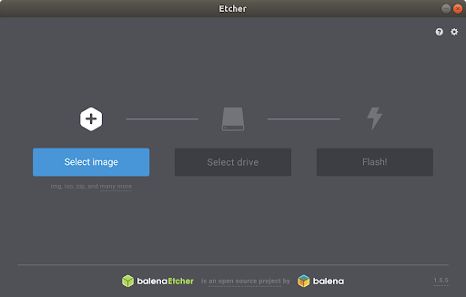

2. Click “Select image” and choose the JetPack zipped image file downloaded earlier.

3. Insert your microSD card. If you have no other external drives attached, Etcher will automatically select the micro SD card as target device. Otherwise, click “Change” and choose the correct device.

    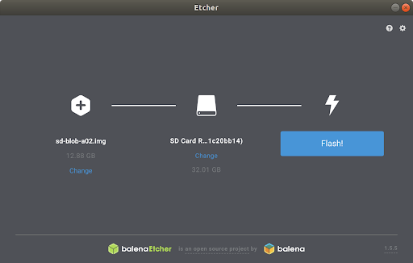

4. Click “Flash!” Your OS may prompt for your username and password before it allows Etcher to proceed.

    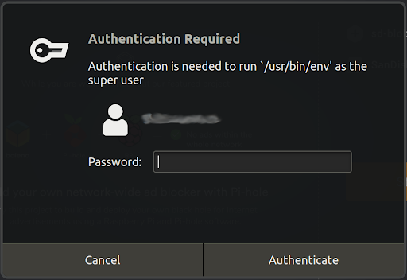

    It will take Etcher 10-15 minutes to write and validate the image if your microSD card is connected via USB3.

5. After Etcher finishes, eject (the triangle with line under it) the SD Card using Files application.

    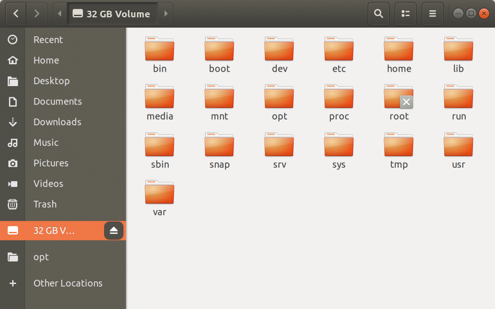

6. Physically remove microSD card from the computer.

### **Option 2: Use Command Line**

1. Open the Terminal application by pressing `Ctrl + Alt + t`.

2. Insert your microSD card, then use a command like this to show which disk device was assigned to it:

    `dmesg | tail | awk '$2 == "sd" {print}'`

    

3. Use this command to write the zipped SD card image to the microSD card:

    `/usr/bin/unzip -p ~/Downloads/jp60-orin-nano-sd-card-image.zip | sudo /bin/dd of=/dev/sda bs=1M status=progress
    `

    For example:

    .png>)

    When the dd command finishes, eject the disk device from the command line:

    `sudo eject /dev/sda`

4. Physically remove microSD card from the computer.

    After your microSD card is ready, proceed to [Setup your developer kit](https://developer.nvidia.com/embedded/learn/get-started-jetson-orin-nano-devkit#setup).

## 2. Setup and First Boot

### 2.1 Setup

1. Insert the microSD card (with system image already written to it) into the slot on the underside of the Jetson Orin Nano module.

2. Power on your computer display and connect it.

3. Connect the USB keyboard and mouse.

4. Connect the provided power supply. The Jetson Orin Nano Developer Kit will power on and boot automatically.

.png>)

### 2.2 First Boot

A green LED next to the USB-C connector will light as soon as the developer kit powers on. When you boot the first time, the Jetson Orin Nano Developer Kit will take you through some initial setup, including:

- Review and accept NVIDIA Jetson software EULA
- Select system language, keyboard layout, and time zone
- Connect to Wireless network
- Create username, password, and computer name
- Log in

### 2.3 After Logging In

You will see this screen. Congratulations!

.png>)

## If First Boot is Unsuccessful

### NOTE

If this first boot is unsuccessful it could be because an old firmware version. If the firmware is below 5.1.0 it can not make the Just to 6.0 or high unless the JetPack SDK is used on a Ubuntu 20.04 machine. (If you don't use a Ubuntu 20.04 machine than the flash will fall and the Jetson will be bricked until it is properly flashed)

The firmware version can be seen when the GUI first boots up you will see the firmware verion at the top on the screen next to the `Jetson UEFI firmware`.

.png>)

## Steps to Update and Flash New Firmware (6.0 +)

### Equitment needed

- Jetson Orin Nano Dev Kit
- Host PC running on **Unbuntu 20.04** with **Nvidia SDK Manager 2.2.0**
- 128 gb sc card
- 500 gb NVMe
- Nvidia Jetson Power cable (19.0V, 2.37A)
- Data capable usb to type-c
- Jumper wire
- Display with display port
- Display port cable
- Keyboard
- Mouse

## 1. Download Jetpack SDK on Ubuntu 20.04 Machine

Start by opening your Ubuntu 20.04 machine and using the [link](https://developer.nvidia.com/sdk-manager) to download the Nvidia SDK Manager. Then creating a Nvidia account to log in to the SDK Manager.

## 2. Hareware Setup

### 2.1 Install SD card and NVMe

Install SD card and blank NVMe into Jetson Orin Nano

### 2.2 Put Jetson in Force Recovery Mode

Connect juper cable to the `FC REC` and `GND` pin to put the Jetson in Force Recovery mode. (This enbles the board to be detected by the SDK manager)


### 2.3 Connect Jetson to Host Computer

 Connect the USB to USB type-c cable with one end going to the machine with Ubuntu 20.04 and the other end going to the type-c port on the Jetson.

 >**Note:** Ensure that the USB to USB type-c cable is data capable.

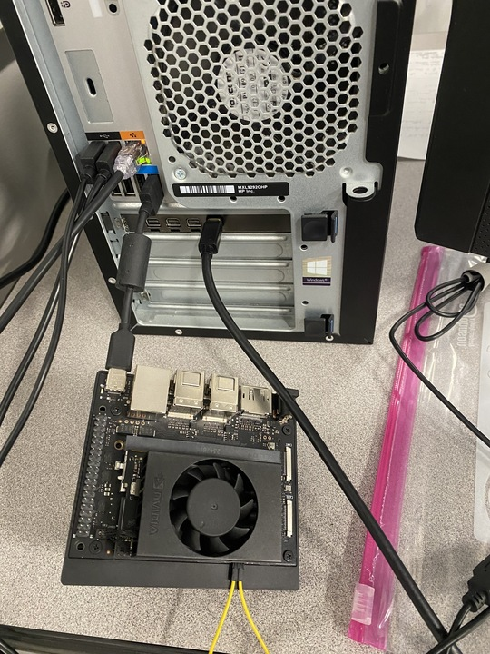

### 2.4 Connect the power source to the Jetson

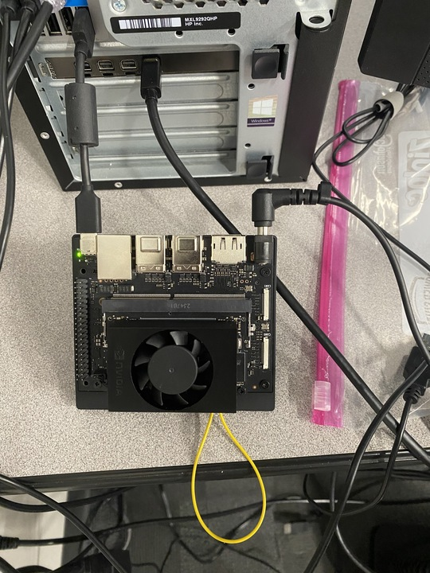

## 3. Update Firmware to JetPack 6.1 (or Latest SDK Version)

### 3.1 Open the SDK Manager (2.2.0 version ) on the Host computer (Ubuntu 20.04)

### 3.2 Select The Jetson Orin Nano Developer Kit

After the `Jetson Orin Nano [8GB developer kit version]` is selected click `OK`

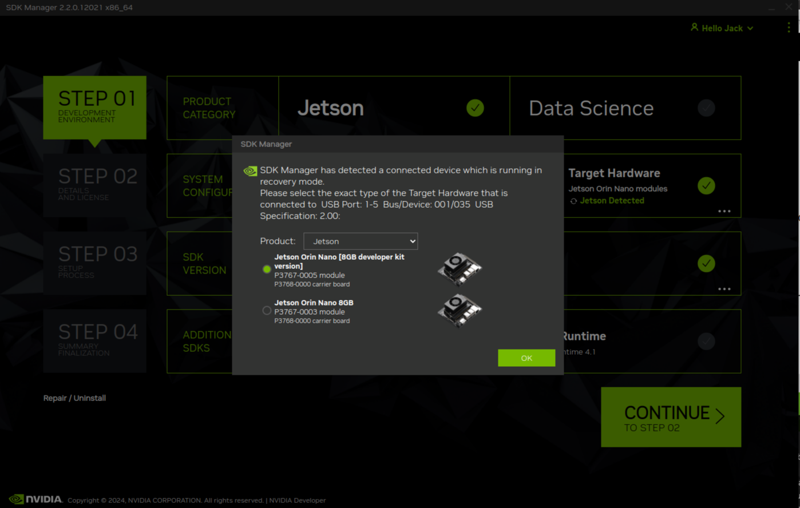

### 3.3 `STEP 1` of SDK Manager

Below is an image that shows the inforamtion that should be selected in `STEP 1` of the SDK Manager. After the information is selected click `CONTINUE TO STEP 2` in the bottom right hand corner of the SDK Manager.

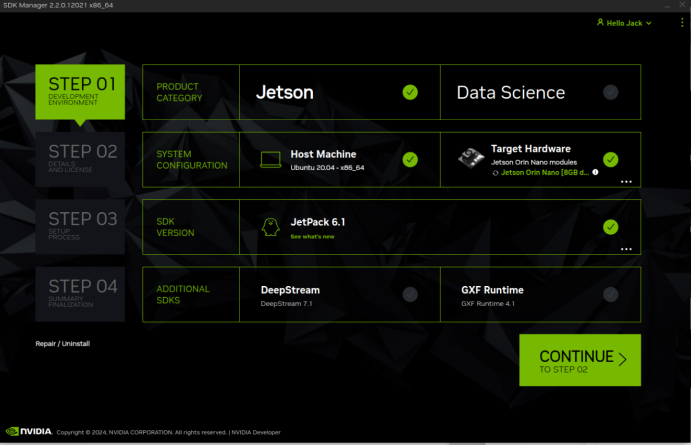

### 3.4 `STEP 2` of SDK Manager

Once in `STEP 2` unsure that Jetson Linux and Jetson Runtime Components are selected under TARGET COMPONENTS.

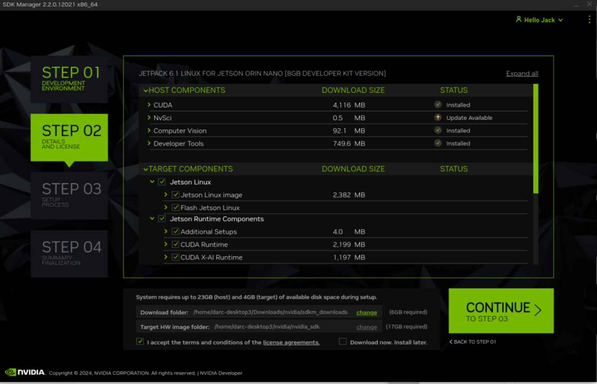

> Before proceeding to `STEP 3` **DISCONNECT** the jumper wire taking the Jetson out of Force Recovery Mode.

In the bottom left hand coner, check the box `I accept the terms and conditions of the license agreement`. Then click `CONTINE TO STEP 3`.

A window will pop up as show below stating "The specified folder doesn't exist. Do you want to create?" Click: **Create**

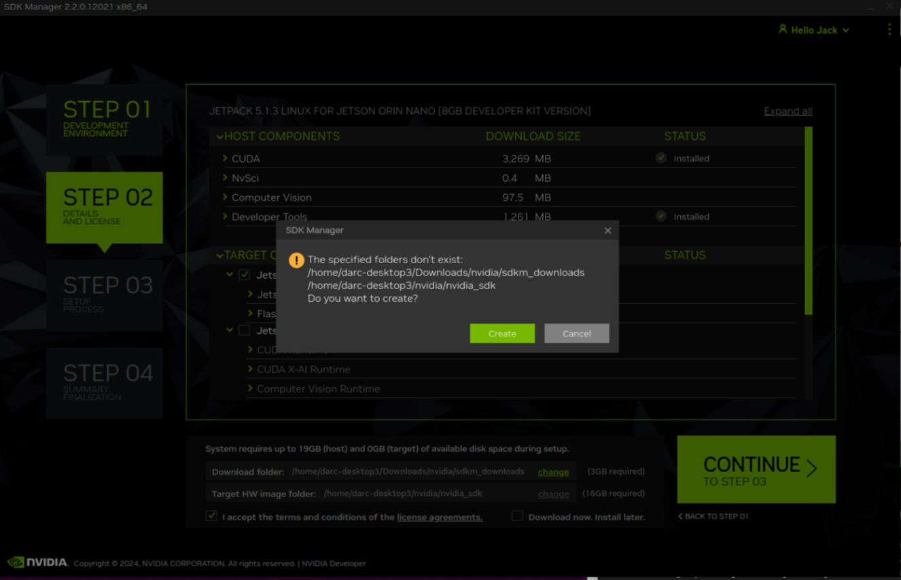

**Next** it will ask for your password.

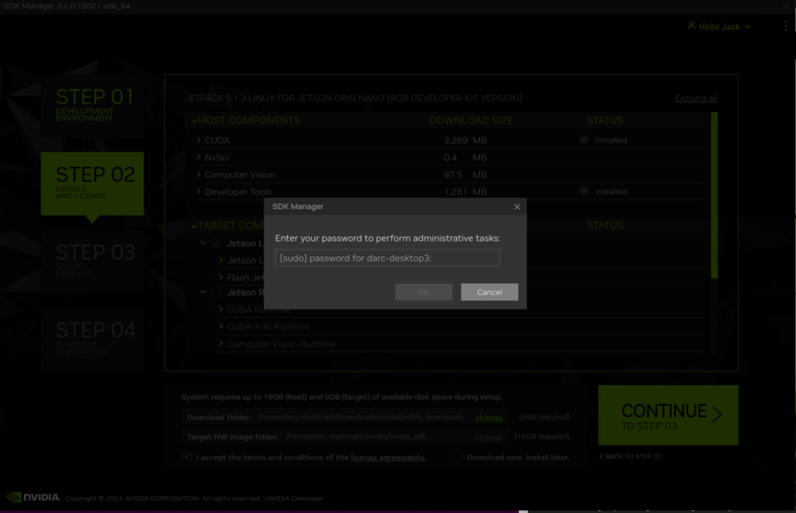

### 3.5 `STEP 3` of SDK Manager

Then all of the host componets will be installed and the Jetson Linux image will be created.

Once the OS image is ready the following screen will appear. Select the following parameters shown in the picture.
(username: darc-f1-<car #>)
(password: lab password)

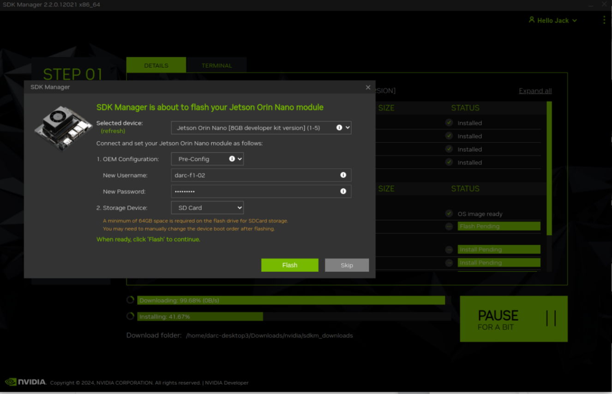

Then all of the host componets will be installed and the Jetson Linux image will be created.

 Once the the flash finishes connect a monitor via display port, mouse and keyboard. The Jeston should be setup. Then login into the system, open a terminal and type `ip addr show` confirm that the IP Address matches the IP address show on the HOst computer. An example is shown below.

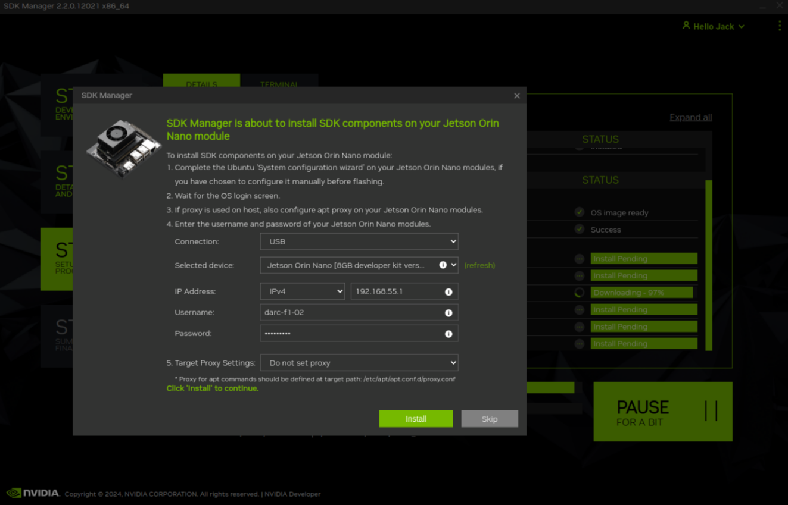

When this install is complete the Jetson is ready to proceed to the next step.

### 3.6 `STEP 4` of SDK Manager

This page will show that the SDK process is finished and the Jetson has been updated.

## 4. Connect the Jetson Orin Nano to WiFi

To connect the WiFi for the Jetson depends on the type of network the Jetson is trying to connect to.

### 4.1 Option 1: Non - Static IP Address

If the Jetson is trying to connect to a large network the IP address may constantly change. To solve this the MAC address can be to the network allowing the Jetson to connect.

To obtain the MAC Address run `ip link show`. Then under the wireless name (example: `wlan0`) there will be a line that starts with `link/ether` following this is the MAC address for the wireless network. (example: `28:d0:43:84:f5:9f`)

### 4.2 Option 2: Static IP Address

If you are connecting the Jetson to a personal network than a static IP address will need to be set. This will take several steps.

Start by finding the wifi connection device. This can be down by running `nmcli d` then use the device name for wifi.

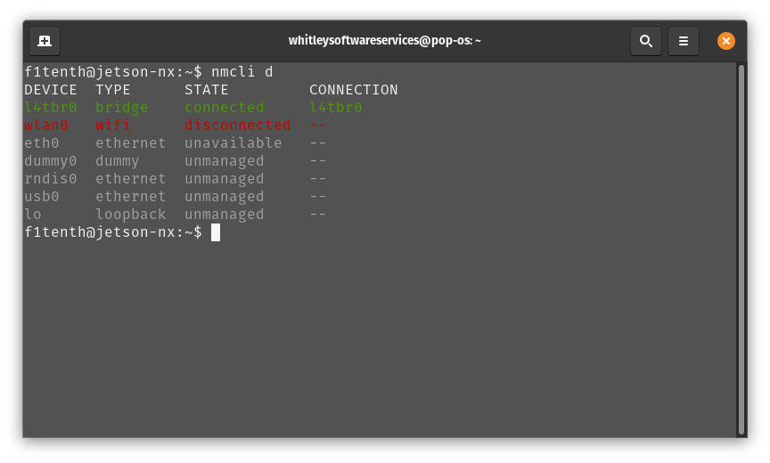

For the example above the device name is wlan0

### 4.2.1 Obtain Current IP Address

 To get the currently-assigned IP address use the command `ip addr show dev wlan0`.

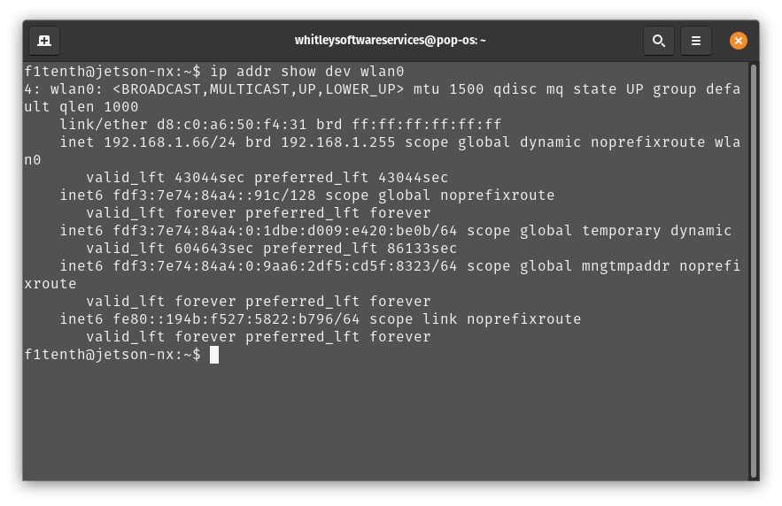

Currently-connected WiFi IP address.

### 4.2.2 Obtain Name of Connection

 To set a static IP address, you will also need to know the name of the connection. This is usually the same as the SSID of the WiFi network but not always. To see the list of current connections, use the command `nmcli c show`.

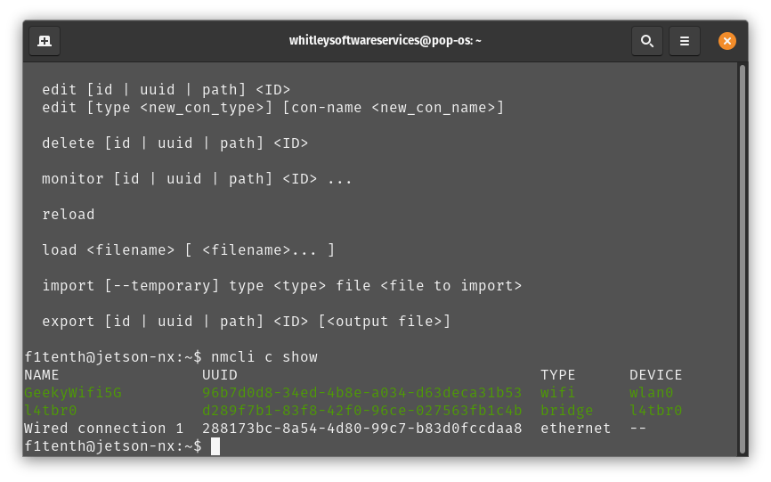

List of connections.

### 4.2.3 Setting Static IP Address:f5

 To set a static IP address use: the command sudo `nmcli c mod [CONNECTION_NAME] ipv4.address [NEW_ADDRESS]/[CIDR]` where `[CONNECTION_NAME]` is replaced with the name of your WiFi connection that you got from step 8, `[NEW_ADDRESS]` is replaced with the static IP address that you want to set, and `[CIDR]` is the [CIDR representation](https://www.ionos.com/digitalguide/server/know-how/cidr-classless-inter-domain-routing/) of the subnet (usually 24).

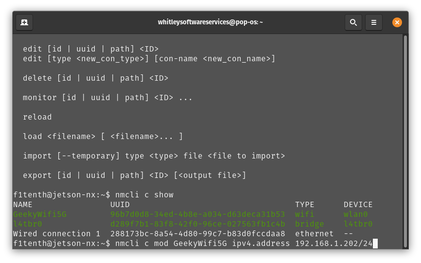

Setting static IP address.

### 4.2.4 Setting Default Gateway

 To set the connection’s default gateway, use the command `sudo nmcli c mod [CONNECTION_NAME] ipv4.gateway [GATEWAY_IP]` where `[CONNECTION_NAME]` is replaced with the name of your WiFi connection that you got from step 8 and `[GATEWAY_IP]` is replaced with the IP address of your WiFi network’s gateway/router.

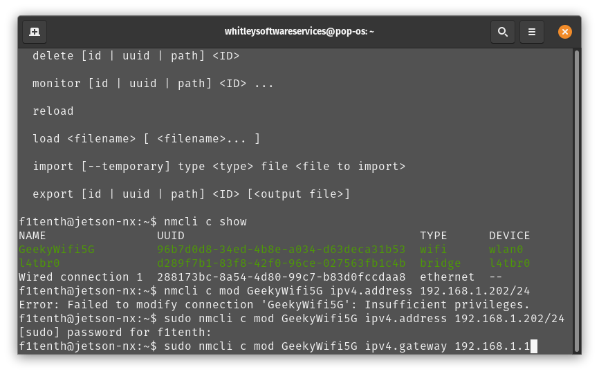

Setting IP gateway.

### 4.2.5 Setting Connection DNS Servers

 To set the connection’s DNS servers, use the command sudo `nmcli c mod [CONNECTION_NAME] ipv4.dns "[DNS_SERVER1]"` where `[CONNECTION_NAME]` is replaced with the name of your WiFi connection that you got from step 8 and `[DNS_SERVERS]` is replaced with a comma-separated list of DNS server IP addresses. Google DNS servers at `8.8.8.8` and `8.8.4.4` are recommended.

### 4.2.6 Setting Connection to Always Use Static IP Address

 To disable DHCP and always use the static IP address on this connection, use the command `sudo nmcli c mod [CONNECTION_NAME] ipv4.method manual` where `[CONNECTION_NAME]` is replaced with the name of your WiFi connection that you got from step 8.

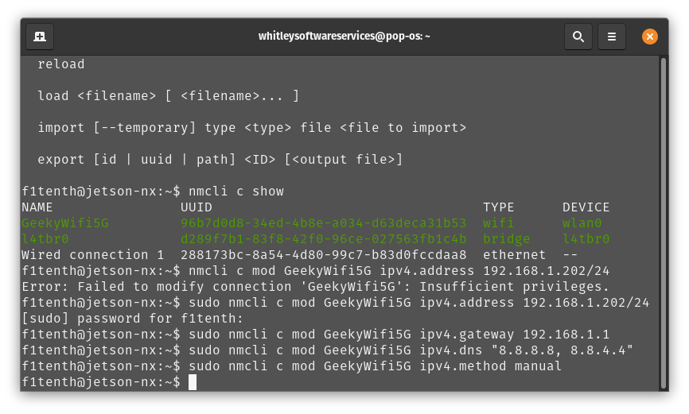

Setting connection to always use static IP.

### 4.2.7 Save Changes

 To save the changes you’ve made, run the command `sudo nmcli c up [CONNECTION_NAME]` where `[CONNECTION_NAME]` is replaced with the name of your WiFi connection that you got from step 8.

### 4.2.8 Use SSH to Verify Changes Have Been Saved

 To verify that you can SSH into the NVIDIA Jetson Orin Nano Developer Kit, verify that the Pit/Host PC is connected to the same network as the Jetson Orin Nano Developer Kit and use an SSH client on the Host PC to connect to the new IP address of the Developer Kit. On Linux this would be done with the command ssh f1tenth@[IP_ADDRESS] where [IP_ADDRESS] is replaced with the static IP address that you assigned to the Developer Kit. After you have verified that SSH works correctly, you can close the connection to the Developer Kit in your terminal emulator.
**After setup SSH using following command**

`ssh -p 22 User@ip adress`

**example:**
`ssh -p 22 darc-f1@10.152.69.100`

**Note**: If network is having difficulty connecting got to the wi-fi settings under the`IPv4` tab and select `Automatic` unsure the `DNS` is clear.

## 5. Install Chromium Using Command Line

- 5.1 Install Chromium using the following command

    `sudo apt-get install chromium-browser`

- 5.2 Open Chromium using the following command

    `chromium-browser`

- 5.3 Add Chromium to favorites by right clicking on the Chromium icon and click "add to favorites"

## 6. Run Jetson Orin Nano from SSD

In the build instruction we applied an SSD NVMe on to the Jetson Orin Nano. We will now make use of this SSD by switching the rootfs to point to the SSD. In effect, the system will now run from the SSD, the SD card is only there to boot the system. Therefore everything you install on your system will automatically installed on the SSD.

Please follow this tutorial [here](https://www.jetsonhacks.com/2020/05/29/jetson-xavier-nx-run-from-ssd/) that has both video and commands integrated to enable your Jetson NX to run from the SSD

>I highly recommend going to the "here" link above it is very helpful even though it is meant for the Jetson Xavier NX the same commands work for the Jetson Orin Nano.

### Important

>These script changes the rootfs to the SSD after the kernel image is loaded from the eMMC/SD card. For the Orin Nano, you will still need to have the SD card installed for booting. As of this writing, the default configuration of the Jetson Orin Nano does not allow direct booting from the NVMe.

The [here](https://www.jetsonhacks.com/2020/05/29/jetson-xavier-nx-run-from-ssd/) link will take you to a cite and execute the following steps

1. Ensure the SSD is correctly installed

2. Watch video on how to format SSD using this [link](https://youtu.be/ZK5FYhoJqIg)
3. Open a terminal window on the Jetson and run the following commands

**Note** :*You should do this process directly after creating a new SD card.*

On the [JetsonHacks account on Github](https://github.com/jetsonhacks/rootOnNVMe), there is a repository rootOnNVMe. Clone the repository:

``` bash
git clone https://github.com/jetsonhacks/rootOnNVMe
```

and switch over to that repository’s directory:

``` bash
cd rootOnNVMe
```

Next, copy the rootfs of the eMMC/SD card to the SSD

``` bash
./copy-rootfs-ssd.sh
```

Finally, we will add a service which will run a script when the system starts up. The script will “pivot the root” to the SSD so that the system will run from the SSD.

``` bash
./setup-service.sh
```

Before moving on run the following command to rest are the Jetson.

``` bash
sudo reboot
```

## 7. Setup Bluetooth and Connect Controller

### Steps to Setup Bluetooth on Jetson Orin Nano

### 7.1 Update System Packages

 Update the system to make sure the system is up to date.

``` bash
sudo apt update
sudo apt upgrade
```

### 7.2 Install Bluetooth Packages

Install the necessary Bluetooth packages if they’re not already installed

```bash
sudo apt install bluez bluez-tools
sudo apt install pulseaudio pulseaudio-module-bluetooth
```

### 7.3 Enable Bluetooth Service

Start and enable the Bluetooth service

```bash
sudo systemctl start bluetooth
sudo systemctl enable bluetooth
```

### 7.4 Check if bluez and bluez-tools are installed

Run this command:

```bash
sudo dpkg -l | grep bluez
```

**If the packages are installed, you should see an output like this:**

``` bash
ii  bluez          <version>     <architecture>   <description>
ii  bluez-tools    <version>     <architecture>   <description>
```

Run this command:

``` bash
dpkg -l | grep pulseaudio
```

This will show all ```pulseaudio``` related packages that are installed. Look for ```pulseaudio``` and ```pulseaudio-module-bluetooth``` in the output. If installed, the output will look similar to:

``` bash
ii  pulseaudio                     <version>     <architecture>   <description>
ii  pulseaudio-module-bluetooth     <version>     <architecture>   <description>
```

**If they are not installed, there will be no output or only partial results.**

#### Now you should be able to go to settings and connect the controller

## 8. Creating a Swapfile

Run the following commands to create a swapfile which can help with memory-intensive tasks

```bash
sudo fallocate -l 4G /var/swapfile
sudo chmod 600 /var/swapfile
sudo mkswap /var/swapfile
sudo swapon /var/swapfile
sudo bash -c 'echo "/var/swapfile swap swap defaults 0 0" >> /etc/fstab'
```

## Stage 2: Connecting the Pit/Host and the Jetson Orin Nano

### Overview

We can now log into the Jetson using a monitor, keyboard, and mouse, but ideally we would want remote access when we’re driving the car. Throughout this tutorial, you will be asked to configure the Jetson’s and your laptop’s network settings. Make sure to get these right! Using the wrong IP address may lead to conflicts with another classmate, meaning neither of you will be able to connect.

If your **Pit/Host** computer has WiFi capability, connect both the computer and the F1TENTH car to the same wirless network.

If the **Pit/Host** computer doesn’t have Wifi capability:

1. Connect the Pit/Host computer to a WiFi router via an ethernet cable.

2. Connect the NVIDIA Jetson Orin Nano to the same router via Wifi.

To make this section easy to follow, the Routers WiFi network SSID will be called and referred to as ```Labnet```. In your scenario, it’ll be the SSID of your router’s access point.

## 1. Vehicle Hardware Setup

If you have a NVIDIA Jetson Orin Nano, it comes with a network card onboard. Make sure the antennas are connected to the network card on the back of the Jetson Orion Nano. The battery should be plugged into the vehicle and the Powerboard should be on.

## 2. Connecting the NVIDIA Jetson Orin to WiFi

This should have been completed in **Stage 1: Configuring Jetson Orin Nano** in the **4th step: Connect the Jetson Orin Nano to WiFi**. Please reference this step if needed.

## 3. Connecting the Pit/Host Computer to WiFi

Now, on the Pit/Host laptop, connect to the same wireless network, ```Labnet```.

If you’re running Linux on the Pit laptop in a virtual machine (VM), connect the Pit computer to the router. Depending on which VM software you have and the default VM configuration, you may also need to set its network adapter configuration to NAT mode. This ensures your VM will share the wireless connection with your host OS instead of controlling the adapter itself.

## 4. Connecting to the Pit/Host to the NVIDIA Jetson Orin Nano

Now that the car and the laptop are on the same network, you should check that you can ping the laptop from the car and you can ping the car from the laptop.

On the NVIDIA Jetson Orin Nano, open a terminal and type: ```ping 192.168.1.151``` (This is the IP address of the Pit computer. This can be found using the `ifconfig` command).
On the Pit computer, open a terminal and type ```ping 195.0.0.5``` (This is the IP address of the NVIDIA Jetson Orin Nano. This can be found using the `ifconfig` command).
Remember to replace the IP addresses in the two lines above with your specific addresses.

You can now SSH into your car from your laptop. Use ``ssh`` in the terminal if you’re on [macOS or Linux](https://support.rackspace.com/how-to/connecting-to-a-server-using-ssh-on-linux-or-mac-os/), use [PuTTY](https://www.123-reg.co.uk/support/servers/how-do-i-connect-using-ssh-putty/) if you’re on Windows.

**An example of this ssh command is as follows:**

 ```bash
 ssh -p 22 darc-f1-01@10.152.69.216
 ```

We recommend using [Terminator](https://terminator-gtk3.readthedocs.io/en/latest/)  while you’re ssh-ed into the car. Therefore you close the terminal and your code on the car is still running, since the SSH session is only paused. You need to install Terminator on the respective system you are using.

**Terminator** can be installed using the following command:

```bash
sudo apt-get install terminator
```

## 5. Using a Remote Desktop

### I am not currently using the remote desktop I am only utilizing ssh for Host Machine. This is becaue I am currently unable to get bluetooth to work with GNOME (light version of Ubuntu)

Although we now have SSH access to the car, it is still inconvenient to run GUI application on the car remotely. In this section, we’ll go over how to set up a remote desktop so you can easily use GUI applications like rviz. In our example, we’ll use **NoMachine**. If you’re an advance user, and can find another remote desktop solution that works on the car, feel free to use it.

First, download NoMachine for your **pit/host** computer’s specific OS [here](https://www.nomachine.com/download). Then, while your Jetson is still connected to the monitor, install NoMachine following this guide [here](https://knowledgebase.nomachine.com/AR02R01074). Note that the guide uses Jetson  Nano, the same applies to Jetson Orin Nano. You only have to follow the Install NoMachine section and don’t have to set up an alternative desktop environment.

After NoMachine is installed on both sides, go to your pit/host’s NoMachine, click **Add** to configure your connection and insert the IP address of the Jetson. You’ll only need to change the Host field. Click connect to connect to the Jetson. You’ll then be prompted the Jetson’s username and password to log in. Now you should have remote desktop access to the Jetson.

#### A. Install [NoMachine](https://www.nomachine.com/download) on Host/Pit computer

#### B. Download and install NoMachine on Jetson with the following commands

```wget https://www.nomachine.com/free/arm/v8/deb -O nomachine.deb```

```sudo dpkg -i nomachine.deb```

#### C. Setup GNOME Flashback instead of XFCE using NoMachine

Run the following code in terminal

```sudo apt install gnome-session```

```sudo systemctl set-default multi-user.target```

```sudo gedit /usr/NX/etc/node.cfg```

Replace the following DefaultDesktopCommand with ```DefaultDesktopCommand "/usr/bin/gnome-session"``` then save and close.

Run the following line in the terminal

```sudo /usr/NX/bin/nxserver --restart```

```sudo reboot```

## Stage 3: Install F1TENTH Driver Stack

**Note** - This section assumes that you have already completed Building the Car and System Configuration.

At the end of this section, you will have the VESC tuned and the lidar connection completed.

With the physical car built and the system configuration setup, we can start to install the firmware needed on the car.

## 1. Configuring the VESC

### Important Safety Tips

>Put your car on an elevated stand so that its wheels can turn without it going anywhere. If you don’t have an RC car stand, you can use the box battery and chager came in.

Make sure you hold on to the car while testing the motor to prevent it from flying off the stand/box.

Make sure there are no objects (or people) in the vicinity of the wheels while testing.

Use a fully-charged LiPO battery instead of a power supply to ensure the motor has enough current to spin up.

### 1.1 Installing the VESC Tool

We need to configure the VESC so that it works with our motor and vehicle transmission. Before you start, you’ll need to install the [VESC Tool](https://vesc-project.com/vesc_tool). You’ll have to register for an account to download. Add the `VESC Tool Free` to cart (you don’t have to fill in any information other than your email.) After checkout, a download link will be sent to your email address. There should be versions of the software for Linux, Windows and macOS.

**Note: Download the VESC tool onto the host computer.**

### 1.2 Powering the VESC and Connecting to Host Computer

First we need to power the VESC. Plug the battery in, and make sure the polarity is correct. Note that you don’t need to turn on the Powerboard for configuring the VESC.

.png>)

Next, unplug the USB cable of the VESC from the Jetson Orin Nano and plug the USB Host Computer that’s running the VESC Tool. You may want to use a longer cable.

.png>)

### 1.3 Launch VESC Tool on Host Computer

Launch the VESC Tool on Host Computer. On the Welcome page, press the AutoConnect button on bottom left of the page. After the VESC is connected, you should see an updated status on the right side of the screen.

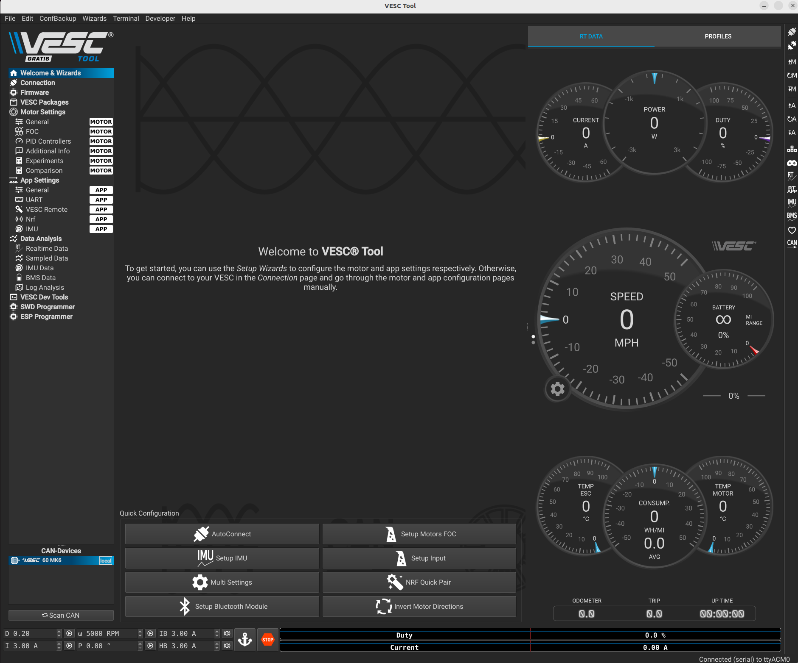

### 1.4 Updating the Firmware on the VESC

The first thing you’ll need to do is to update the firmware onboard the VESC. By going to the `Firmware` tab and selection update.

With latest default firmware you will need to enable servo out, go to **App Settings > General > Enable Servo Output** in the VESC Tool to enable servo out. Then click the A with a down arrow (Write app configuration)


### 1.5 Detecting and Calculating Motor Parameters

To detect and calculate the FOC motor parameters, navigate to the FOC tab under Motor Settings on the left. At the bottom of the screen, follow the direction of the arrows and click on the four buttons one by one, and follow the on screen prompt. Note that during the measuring process, the motor will make noise and spin, make sure the wheels of your vehicle are clear.

.png>)

After the motor parameters are measured, the fields at the bottom of the screen should turn green. Click on the Apply button, and click the Write Motor Configuration button.

.png>)

### 1.6 Changing the Openloop Hysteresis and Openloop Time

Navigate to the **Sensorless** tab on top of the screen. Change the **Openloop Hysteresis** and **Openloop Time** to 0.01, and click the **Write Motor Configuration** button. (Your page my look different than mine but the name of the parameters ae the same.)

.png>)

### 1.7 Tuning the PID controller

Now you can start tuning the speed PID controller. To see the RPM response from the motor, navigate to the **Realtime Data** tab under **Data Analysis** on the left. Click **Stream Realtime Data** button on the right (the button with letters RT), and navigate to the **RPM** tab on the top of the screen. You should see RPM data streaming now.

.png>)

To create a step response for the motor, you can **set a target RPM at the bottom of the screen** (values between 2000 - 10000 RPM). Click the **play button** next to the text box to start the motor. Note that the motor will spin, so make sure the wheels of your vehicle are clear from objects. Click the Anchor or **STOP** button to stop the motor.

.png>)

You want to look for a clean step response that has a quick rise time and zero to very little steady state error. Adjust the gains accordingly by navigating to the **PID Controllers** tab under **Motor Settings** on the left, and change the Speed Controller gains. General rules of tuning PID gains apply. If you’re seeing a lot of oscillations, try changing the Speed PID Kd Filter. **Don't for get to click the "Write Motor Configuration" button.**

.png>)

These are my settings.


### 1.8 Changing the hardware speed limit

By default, the motor configuration sets a safe top motor RPM. If you wish to change the hard limit set by the VESC firmware, you can go to Motor Settings > General, and change the max ERPM for forward and backwards rotations. You’ll also have to change the configuration file mentioned in the Odometry Tuning section in the software stack setup to change the software limit for your motor ERPM.

**Don't for get to click the "Write Motor Configuration" button.**

.png>)

### Danger

>Please see the Odometry Tuning section in the software stack setup to see how vehicle velocity is converted to ERPM for the motor to calculate a safe maximum erpm for your motor.

## 2. Hokuyo 10LX Ethernet

**Note:** If you have a 30LX or a LIDAR that connects via USB, you can skip this section.

Connect to the Jetson Orin either via SSH or a wired connection (monitor, keyboard, mouse).

In order to utilize the 10LX you must first ensure the Lidar ethernet cable is plugged into the Jetson and configure the network. From the factory the 10LX is assigned the following **IP Address:** ```192.168.0.10```. Note that the lidar is on subnet 0.

Open Setting in the Linux GUI and go to the Network Configuration on the Jetson Orin Nano. Add a new wired connection by going to the plus sign icon. Then navigate to the  `Idenity` tab and add the name `Hokuyo`, then go to the `ipv4` tab, add a route such that the ethernet port is assigned.

**NOTE: Add screenshots from Jetson and update the steps**

IP address ```192.168.0.15```

Subnet mask is ```255.255.255.0```

Gateway is ```192.168.0.10```

When you plug in the 10LX make sure that the Hokuyo connection is selected. If everything is configured properly you should now be able to ping ```192.168.0.10```.

### If this doesn't work use the following commands

Open the terminal: `ctrl` + `alt` + `t`

```bash
sudo ip addr add 192.168.0.1/24 dev <ethernet port name>
```

Then go to setting and edit the Network connection. By going to the ipv4 tab and entering in the gateway ```192.168.0.10```. Also double check the IP address and the Subnet mask. Then go to the identiy tab and enter the name Hokuyo.

Now you should be able to ping ```192.168.0.10```.

## 3. F1TENTH Driver Stack Setup

**NOTE:** This is how to setup the driver stack WITHOUT DOCKER

### Overview

This setup is being ran on JetPack 6.0 since the Jetson can run on Ubuntu 22.04, and we can install ROS 2 natively and conveniently. We use ROS 2 Humble for communication and run the car. You can find a tutorial on ROS 2 [here](https://docs.ros.org/en/humble/Tutorials.html).

In the following section, we’ll go over how to set up the drivers for sensors and the motor control:

- 3.1 Setting up udev rules for our sensors
- 3.2 Installing ROS 2 and its utilities
- 3.3 Setting up the driver stack
- 3.4 Launch teleoperation and the LiDAR

Everything in this section is done on the **Jetson Orin Nano Dev Kit** so you will need to connect to it via SSH from the Pit laptop or plug in the monitor, keyboard, and mouse.

### 3.1 Setting up udev rules for our sensors

*Goal is to name the VESC and the Hokuyo Lidar (Ethernet connection)

#### Naming the Lidar Sensor

```sudo gedit /etc/udev/rules.d/99-ethernet-hokuyo.rules```

Then add the following code.

```SUBSYSTEM=="net", ACTION=="add", ATTR{address}=="48:b0:2d:eb:e4:dd", NAME="hokuyo"```

The ATTR{address} can be found for your device by running `ifconfig` in a new terminal. Then find the ether number under the ether net connection.

#### Naming the VESC

```sudo gedit /etc/udev/rules.d/99-vesc.rules```

```KERNEL=="ttyACM[0-9]*", ACTION=="add", ATTRS{idVendor}=="0483", ATTRS{idProduct}=="5740", MODE="0666", GROUP="dialout", SYMLINK+="sensors/vesc"```

Finally, trigger (activate) the rules by running

```bash
sudo udevadm control --reload-rules
sudo udevadm trigger
```

Reboot your system, and you should find VESC by running ```ls /dev/sensors```.

### 3.2 Installing ROS 2 and its utilities

Below are instructions on how to install ROS 2 humble and the necessary utilites.

### 3.2.1 Set locale

Make sure you have a locale which supports UTF-8. If you are in a minimal environment (such as a docker container), the locale may be something minimal like POSIX. We test with the following settings. However, it should be fine if you’re using a different UTF-8 supported locale.

```bash
locale  # check for UTF-8

sudo apt update && sudo apt install locales
sudo locale-gen en_US en_US.UTF-8
sudo update-locale LC_ALL=en_US.UTF-8 LANG=en_US.UTF-8
export LANG=en_US.UTF-8

locale  # verify settings
```

### 3.2.2 Setup Sources

You will need to add the ROS 2 apt repository to your system.

First ensure that the Ubuntu Universe repository is enabled.

```bash
sudo apt install software-properties-common
sudo add-apt-repository universe
```

Now add the ROS 2 GPG key with apt.

```bash
sudo apt update && sudo apt install curl -y
sudo curl -sSL https://raw.githubusercontent.com/ros/rosdistro/master/ros.key -o /usr/share/keyrings/ros-archive-keyring.gpg
```

Then add the repository to your sources list.

```bash
echo "deb [arch=$(dpkg --print-architecture) signed-by=/usr/share/keyrings/ros-archive-keyring.gpg] http://packages.ros.org/ros2/ubuntu $(. /etc/os-release && echo $UBUNTU_CODENAME) main" | sudo tee /etc/apt/sources.list.d/ros2.list > /dev/null
```

### 3.2.3 Install ROS 2 packages

Update your apt repository caches after setting up the repositories.

```bash
sudo apt update
```

ROS 2 packages are built on frequently updated Ubuntu systems. It is always recommended that you ensure your system is up to date before installing new packages.

```bash
sudo apt upgrade
```

<span style="color:yellow;">

### Warning

Due to early updates in Ubuntu 22.04 it is important that systemd and udev-related packages are updated before installing ROS 2. The installation of ROS 2’s dependencies on a freshly installed system without upgrading can trigger the removal of critical system packages.

Please refer to ros2/ros2#1272 and Launchpad #1974196 for more information.

<span style="color:white;">

Desktop Install (Recommended): ROS, RViz, demos, tutorials.

```bash
sudo apt install ros-humble-desktop
```

### 3.2.4 Try an Example to see if it works

In one terminal, source the setup file and then run a C++ talker:

```bash
source /opt/ros/humble/setup.bash
ros2 run demo_nodes_cpp talker
```

In another terminal source the setup file and then run a Python listener:

```bash
source /opt/ros/humble/setup.bash
ros2 run demo_nodes_py listener
```

You should see the `talker` saying that it’s `Publishing` messages and the `listener` saying `I heard` those messages. This verifies both the C++ and Python APIs are working properly. Hooray!

### 3.2.5 Now install ROS Utilities

#### Install Colcon

```bash
sudo apt install python3-colcon-common-extensions
```

#### Install dependencies

```bash
sudo apt install python3-bloom python3-rosdep fakeroot debhelper dh-python
```

#### Initialize rosdep

Initialize the rosdep database by calling:

```bash
sudo rosdep init
rosdep update
```

Note that the `rosdep init` command may fail if it has already been initialized in the past; this can safely be ignored.

### 3.3 Setting up the driver stack

First, we’ll create a ROS 2 workspace for our driver stack with the following commands. We’ll be using `f1tenth_ws` as the name of our workspace going forward in this section.

```bash
cd $HOME
mkdir -p f1tenth_ws/src
```

Then, make this into a ROS 2 workspace by running:

```bash
cd f1tenth_ws
colcon build
```

Next, we’ll clone the repo into the src directory of our workspace:

```bash
cd src
git clone https://github.com/f1tenth/f1tenth_system.git
```

Then use the following commands to use the humble-devel branch from the F1tenth repo

```bash
cd f1tenth_system
git checkout humble-devel
```

Then due to a dependency error with the `ackermann_mux` directroy you will need to edit the .gitmodules. You can do this by entering the `~/f1tenth_ws/src/f1tenth_system$` directory and running the following commands.

This command ensures that the .gitmodule is in the correct directory. As you should see `.gitmodules` when this command is ran.

```bash
ls -a
```

To edit the `.gitmodules` file use a text editor. The example below uses the nano text editor. If it is not installed already it can be installed using the following command.

```bash
sudo apt install nano
```

Next you will edit `.gitmodules` by running the following command.

```bash
nano .gitmodules 
```

Then, once in the nano text editor enter the following code. The reason that you are changing the ackermann-mux branch to foxy-devel is because this is the latest ROS2 branch avalible on GitHub.

To save and exit in nano type `ctrl` + `x` to exit and then `y` to say yes to saving the changes.

```bash
[submodule "vesc"]
    path = vesc
    url = https://github.com/f1tenth/vesc.git
    branch = humble
[submodule "ackermann_mux"]
    path = ackermann_mux
    url = https://github.com/f1tenth/ackermann_mux.git
    branch = foxy-devel
[submodule "teleop_tools"]
    path = teleop_tools
    url = https://github.com/f1tenth/teleop_tools.git
    branch = foxy-devel
```

Then we’ll update the git submodules and pull in all the necessary packages

```bash
git submodule update --init --force --remote
```

After git finishes cloning, we can now install all dependencies for our packages with rosdep:

```bash
cd $HOME/f1tenth_ws
source /opt/ros/humble/setup.bash
rosdep update
rosdep install --from-paths src -i -y
```

Lastly, after dependencies are installed, we can build our workspace again with the driver stack pacakges:

```bash
colcon build
```

You can find more details on how the drivers are set up in the README of the f1tenth_system repo.
Install colcon If you haven't installed colcon yet, follow these steps:

#### Install Colcon

```bash
sudo apt install python3-colcon-common-extensions
```

### Possible Error and Fix

If the following error occurs

``` bash
CMake Error at /opt/ros/humble/share/io_context/cmake/io_context-extras.cmake:17 (find_package):
  By not providing "Findasio_cmake_module.cmake" in CMAKE_MODULE_PATH this
  project has asked CMake to find a package configuration file provided by
  "asio_cmake_module", but CMake did not find one.

  Could not find a package configuration file provided by "asio_cmake_module"
  with any of the following names:

    asio_cmake_moduleConfig.cmake
    asio_cmake_module-config.cmake

  Add the installation prefix of "asio_cmake_module" to CMAKE_PREFIX_PATH or
  set "asio_cmake_module_DIR" to a directory containing one of the above
  files.  If "asio_cmake_module" provides a separate development package or
  SDK, be sure it has been installed.
Call Stack (most recent call first):
  /opt/ros/humble/share/io_context/cmake/io_contextConfig.cmake:41 (include)
  /opt/ros/humble/share/serial_driver/cmake/ament_cmake_export_dependencies-extras.cmake:21 (find_package)
  /opt/ros/humble/share/serial_driver/cmake/serial_driverConfig.cmake:41 (include)
  /opt/ros/humble/share/ament_cmake_auto/cmake/ament_auto_find_build_dependencies.cmake:67 (find_package)
  CMakeLists.txt:14 (ament_auto_find_build_dependencies)
```

Use the following command

```bash
sudo apt update && sudo apt install ros-humble-asio-cmake-module
```

**NOTE:** After editing any file in the f1tenth_ws directory you will have to rebuild and source the workspace using the following commands.

```bash
cd $HOME/f1tenth_ws
colcon build
source install/seup.bash
```

#### After rebuilding and source ing the workspace there will be several `stderr` warnings please use the following commands to midigate these warnings

Code format: `find . -type f -exec sed -i 's/old/new/g' {} \;`

```bash
find . -type f -exec sed -i 's/script-dir/script_dir/g' {} \;
find . -type f -exec sed -i 's/install-script/install_script/g' {} \;
```

#### After running the commands above to fix the errors you will need to rebuild and source the workspace.

### 3.4 Launch teleoperation and the LiDAR

This section assumes that the lidar has already been plugged in (either to the USB hub or to the ethernet port). If you are using the Hokuyo 10LX or a lidar that is connected via the ethernet port of the Jetson, make sure that you have completed the Hokuyo 10LX Ethernet Connection section before preceding.

### 3.4.1 Setup Lidar Parameters

Before the bringup launch, you’ll have to set the correct parameters according to which LiDAR you’re using in the params file `sensors.yaml`. All parameter files are located in the following location:

```bash
nano $HOME/f1tenth_ws/src/f1tenth_system/f1tenth_stack/config/sensors.yaml
```

If you’re using an ethernet based LiDAR, set the ip_address field to the corresponding ip address of your LiDAR. (You won't need to change the yaml file)

The sensors.yaml should look as follows:

```yaml
urg_node:
  ros__parameters:
    angle_max: 3.14
    angle_min: -3.14
    ip_address: "192.168.0.10"
    ip_port: 10940
    # serial_port: "/dev/sensors/hokuyo"
    serial_baud: 115200
    laser_frame_id: "laser"
    calibrate_time: false
    default_user_latency: 0.0
    diagnostics_tolerance: 0.05
    diagnostics_window_time: 5.0
    error_limit: 4
    get_detailed_status: false
    publish_intensity: false
    publish_multiecho: false
    cluster: 1
    skip: 0
```

If you’re using a USB based LiDAR, comment out the ip_address field, and uncomment the line with the serial_port field. And set the value to the correct udev name from udev rules set up.

### 3.4.2 Sourcing Overlay and Workspace

In your running terminal, run the following commands to source the ROS 2 underlay and our workspace’s overlay:

```bash
source /opt/ros/humble/setup.bash
cd $HOME/f1tenth_ws
source install/setup.bash
```
### 3.4.3 Launching `f1tenth_stack`

Then, you can launch the bring up with:

```bash
ros2 launch f1tenth_stack bringup_launch.py
```

Running the bringup launch will start the VESC drivers, the LiDAR drivers, the joystick drivers, and all necessary packages for running the car. To see the LaserScan messages, in a new terminal window, run

### 3.4.4 Opening RViz

```bash
source /opt/ros/humble/setup.bash
cd $HOME/f1tenth_ws
source install/setup.bash
rviz2
```
### 3.4.5 Setting up RViz

After the RViz window opens we will setup the LaserScan to view the point cloud populated by the lidar in real time.

Start by change the **Fixed Frame** parameter from **map** to **laser**


Then you can add a LaserScan visualization in rviz by going to `Add`. Next a rvis create visualization window will open. After this go to the `By topic` tab and select `LaserScan` under the /scan section. Finally select `OK` at the bottom right on the create visulaization window.


If RViz is populating a blank screen is could be because RViz is misconfigured. Try the following steps.

1. Close RViz2
2. Delete the saved configuration file (if it exists):

    ```bash
    rm ~/ .rviz2/default.rviz
    ```

3. Relaunch RViz2:

    ```
    rviz2
    ```

## 4. Driving the F1Tenth Car

## 4.1 Manual Driving

### Overview

Before we can get the car to drive itself, it’s a good idea to test the car to make sure it can successfully drive on the ground under human control. Controlling the car manually is also a good idea if you’ve recently re-tuned the VESC or swapped out a drivetrain component, such as the motor or gears. Doing this step early can spare you a headache debugging your code later since you will be able to rule out lower-level hardware issues if your code doesn’t work.

You **MUST** connect to the Jetson via SSH or Remote Desktop for this section.

### 4.1 Vehicle Inspection

We want to minimize the number of accidents so before we begin, let’s first inspect our vehicle.

1. Make sure you have the car running off its LIPO battery.

2. Make sure you have the VESC connected.

3. Ensure that both your car and laptop are connected to a wireless access point if you need the car connected to the Internet while you drive it. Otherwise, go back and go through Configure Jetson and Peripherals.

4. Make sure you’ve cloned the f110_system repository.

5. This section uses the program terminator to let you run multiple terminals over one SSH connection. You can also use the remote desktop if you prefer a GUI.

### 4.2 Driving the Car

1. Open a terminal on the Pit laptop and SSH into the car from your computer.

2. Launch teleop following the instructions for Launching and Testing teleop and the LiDAR from the driver stack setup.

3. Hold the LB button (Dead man’s switch) on the controller to start controlling the car. Use the left joystick to move the car forward and backward and the right joystick for steering. If you’re using Logitech F710, switch the switch at the back of the joystick to D. The mode light in the front of the joystick should not be constantly on. If it is, press the mode button once.

>Note: In the LB button  also know as the deadman switch is not presssed then the car will not enter the `human control` mode and the controller will not drive the car.

### 4.2.1 Troubleshooting

During teleop, if the joystick is not mapped correctly, you can change the mapping using the command 

```bash
nano $HOME/f1tenth_ws/src/f1tenth_system/f1tenth_stack/config/joy_teleop.yaml`. 
```

Under the `human control` section of the joy_teleop file you will see `deadman_button` and 2 `axis` one for for `drive-speed` and the other for `drive-steering_angle`. To ensure the controller is mapped correctly use the following steps.

1. Ensure the controller is connected correctly by using the bluetooth section in settings.

2. Install the a Joystick app to visualize the inputs.

    ```bash
    sudo apt install jstest-gtk
    ```

3. Then run the following command in the terminal to open the tester and select the wireless controller.

    ```bash
    jstest-gtk
    ```

4. After the Joystick Preferences window opens double click on the Wireless Controller and the Wireless Controller window will open. This will allow you to view the inputs of the controller and change the 'joy_teleop.yaml` file if neccessary.

    

If **nothing happens**, one reason can be that the driver name is listening on the wrong port for the joystick. To double check, you can check `joy_teleop.yaml` again for the device_name pararmeter. If you’re using the Logitech joystick, the name should match with the udev name we’ve set up before. **If you’re using another joystick and did not set udev rules**, you can check the assigned name by running ls /`dev/input/*`. It’ll usually follow the format `/dev/input/js*`, for example `/dev/input/js0`.

Note that the **LB button acts as a “dead man’s switch”**, as releasing it will stop the car. This is for safety in case your car gets out of control.

You can see a **mapping of all controls** used by the car in the `joy_teleop.yaml` file. For example, in the default configuration, axis 1 (left joystick’s vertical axis) is used for throttle, and axis 2 (right joystick’s horizontal axis) is used for steering. These might be different joystick to joystick.

**Motor rotation direction negated**. If you’re car is driving backwards when commanded driving forward, move to the next section to see how to reverse it.

**VESC out of sync errors**: Check that the VESC is connected. If the error persists, make sure you’re using the right VESC firmware.

**Serial port busy errors**: Your VESC might have just booted up, give it a few seconds and try again.

**SerialException errors** and you’re using the 30LX Hokuyo, the errors might be due to a port conflict: make sure you’ve set up udev rules, as explained in this section.

**urg_node related errors**: Check the ports (e.g. an ip address in sensors.yaml can only be used by 10LX, not 30LX, and vice-versa for the udev name /dev/sensors/hokuyo).

### Manual Test of Teleop Commands

If you confirm that joystick inputs are present but the car isn't responding, you can try publishing manual commands to the /ackermann_cmd topic as mentioned shown below.

```bash
ros2 topic pub /ackermann_cmd ackermann_msgs/msg/AckermannDriveStamped "drive: {speed: 1.0, steering_angle: 0.0}"
```


## Calibrating the Odometry

### 4.3 Calibrating the steering and odometry

Now that everything is built, configured, and installed, the odometry of the vehicle needs to be calibrated. The VESC receives input velocities in m/s and steering angles in radians. However the motor and servo requires commands in revolution per minute (RPM) and servo positions. The conversion parameters will need to be tuned to your specific car.

### 4.3.1 Location of vesc.yaml file

 The parameters in vesc.yaml need to be calibrated. This yaml file is located at:

```bash
HOME/f1tenth_ws/src/f1tenth_system/f1tenth_stack/config/vesc.yaml
```

### 4.3.2 Ensure the Car is Lifted

 In the first few steps, make sure you’ve lifted the car up with a pit stand or a box, so the wheels can spin freely.

### 4.3.3 Check Drive Motor Direction

First, we need to check if our motor is rotating in the right direction. If when given a positive velocity, or command moving forward with the joystick, if the motor is spinning in the reverse direction, open the VESC Tool on the host computer, connect the car to the host computer via cable and select `AutoConnect`. After the car is connected to the host computer select `Invert Motor Directions` and finally select `Inverted` slide to switch the motor direction.


### 4.3.4 VESC Driver Interpreting Motor Rotation Correctly

Next, we’ll also need to check if the VESC driver is interpreting the motor rotation direction correctly. To do this, after launching teleop with the bringup launch, echo the /odom topic in a new bash window inside the container with this command: `ros2 topic echo --no-arr /odom`. The `--no-arr` argument hides the large covariance matrices when echoing the odometry message. Give a positive velocity command (forward throttle with the joystick), and pay close attention to the `pose/pose/position/x` field of the echoed messages. If it is increasing in the reverse direction, we’ll have to fix that. If it is reversed, modified the source code located at:

```bash
nano $HOME/f1tenth_ws/src/f1tenth_system/vesc/vesc_ackermann/src/vesc_to_odom.cpp
```

if you’re using the driver stack natively, or on the host if you’re using docker containers, and

```bash
/f1tenth_ws/src/f1tenth_system/vesc/vesc_ackermann/src/vesc_to_odom.cpp
```

in the container if you’re using docker containers.

Modify line `100` so it reads:

```bash
double current_speed = -(-state->state.speed - speed_to_erpm_offset_) / speed_to_erpm_gain_;
```

After changing the source code, you’ll have to go back to the workspace at /f1tenth_ws, and call `colcon build` again. Also remember that whenever you **rebuild the workspace**, you’ll have to call the commands to source the underlay and the overlay again.

**Note: In the following steps that adjust parameters in the yaml file, you’ll have to call `colcon build` after every change before launching teleop again**

### 4.3.5 Calibrating Odometery

 After the motor directions are fixed, and the odometry is in the right direction, we can now start tuning the steering and the odometry gains.

### 4.3.5.1 Steering Offset

 The first to be tuned is the Steering Offset. This parameter will determine the offset we put on the servo, and whether the car can drive straight when given no steering input. Again, start teleop with the bringup launch. Drive the car in a straight line a couple times with no steering input for a couple meters, and see if it’s driving straight. Adjust the `steering_angle_to_servo_offset` parameter in `vesc.yaml` if it’s not. Make small adjustment everytime (in the magnitude of 0.1). Repeat until you find the correct offset so the car drives straight.

**Don't forget to colcon build and source the workspace everytime you make an adjustment.**

>**Note:** In the following steps, you’ll need to lay down the tape measure straight on the ground. It is helpful to tape the tape measure so it doesn’t move around.

### 4.3.5.2 Tune Steering Gain

Next, we’ll tune the Steering Gain. This parameter determines the smallest turning radius of the car. We’ll determine the desired turning radius given the maximum steering angle of the car we’re setting, which is 0.36 radians in both directions. The corresponding turning radius could be then calculated with $R=L/(2\sin(\beta))$, where L is the wheelbase of the car, which is around 0.33 meters; $\beta$ is calculated as $\arctan(0.5\tan(\delta))$, with $\delta$ being the maximum steering angle of the car. After calculations, when turning a half circle, the desired diameter of the half circle should be 1.784 meters.

Place the car at the 0 of the tape measure such that the rear axle of the car is parallel to the tape measure, and the x-axis (roll axis) of the car coincides with the tape measure at 0.

Start teleop. Set the steering angle to the maximum to one side depending on your setup (e.g. if the rest of the tape measure is on the left side of the car, turn left).

Hold the steering, and drive forward slowly and steadily until the car runs over the tape measure again and the rear axle realigns with the tape measure. Now the car should be in the opposite direction to where you started.

Take a measurement on the tape measure. The goal is 1.784 meters. If the measurement overshoots, increase the gain slightly (0.1 at a time). If it undershoots, decrease the gain. Repeat the process until you’ve hit 1.784 meters.

If you notice that the wheels turn to different angles on the two directions when give maximum steering angles, adjust the servo_min and servo_max numbers until they’re symmetric.

### 4.3.5.3 Tuning ERPM gain

Next, we’ll tune the ERPM gain. This parameter determines the conversion from desired velocity in meters/second to desired motor ERPM.

Place the car at the 0 of the tape measure such that the rear axle of the car coincides with 0 and the x-axis (roll axis) of the car is parallel to the tape measure.

Start teleop. Open another bash window in the container, and run r`os2 topic echo --no-arr /odom`. We’re particularly interested in the `pose/pose/position/x` value. Before giving any driving commands on the joystick, this value should be zero. If it is not zero, kill teleop and restart teleop.

If you notice this value is drifting even when the car is stationary. Change the `speed_to_erpm_offset` value so that it stops drifting.

Drive slowly and steadily forward without any steering input for more than 3 meters. Record the distance traveled by the car on the tape measure. Note that you’ll have to take the reading from the rear axle.

Compare the measured value to the value shown in the echoed message. If the distance reported by echo is larger, decrease the speed_to_erpm_gain value. Otherwise increase the gain. The change is usually on the order of thousands. Note that changing this value also changes the forward speed of teleop. Please drive carefully once the velocity is calibrated. If the forward speed when teleoping is too high, change the scale in human_control for drive-speed in joy_teleop.yaml.

Repeat the process until these values are within 2-3 cm.

> Note: Changing the software speed limit
If you wish to change the top speed of the car and has already followed the instructions to change the hardware limit in the vesc firmware section. All you’ll need to do is also change the speed_min and speed_max values in vesc.yaml. Note that the corresponding max speed in meters/second will be the max erpm value divided by the erpm gain. (e.g. speed_max/speed_to_erpm_gain)
